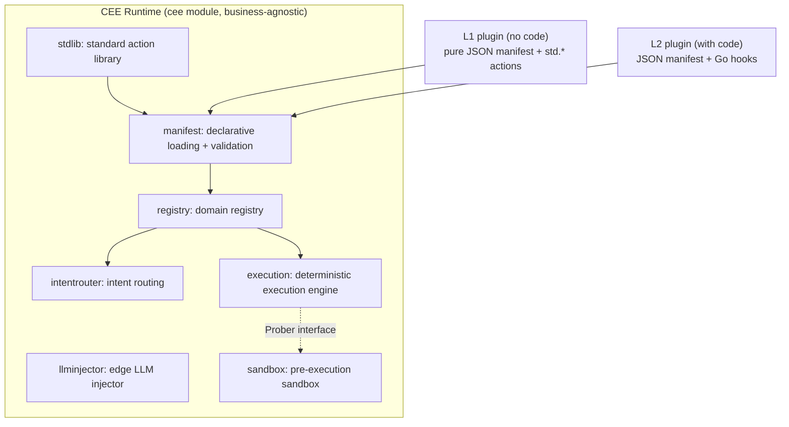

# CEE — Cognitive Execution Engine

> 中文版：[README.md](README.md)

> Pulling agents back from probabilistic trial-and-error into deterministic engineering.
> A business-agnostic protocol for deterministic-first agent execution, where the LLM is an edge tool — not the driver.

[](https://github.com/p0nymc1/cee/actions/workflows/ci.yml)

> **Want to see it actually run first?** Click the badge above to open the latest CI run. It publishes a generated
> **run report**: full execution output for every scenario, a per-step trace, the plugin leaderboard, and validation
> results for every shipped manifest — all produced by a GitHub runner on a clean machine, not hand-written into docs.

> Design rationale, current state, and roadmap: [**Whitepaper**](docs/WHITEPAPER.en.md) (for technical review) ·
> [**Pitch deck**](docs/PITCH.en.md) (ten pages, problem before architecture).
> Every number in both documents is reproducible via `cee bench`, `make stats`, or CI. Anything not yet measured is
> labelled a target, never a result.

CEE is not an application for one industry. It is a **business-agnostic deterministic execution protocol**. Its bet is
simple: most business processes stuffed into "agents" have a well-defined path and do not need an LLM deciding each
step. The one place an LLM is genuinely needed is turning unstructured input into structured fields.

So CEE hands control back to a deterministic state machine and demotes the LLM to an **edge tool that extracts and
never decides**. Any industry can plug its processes in as a domain plugin without changing a single line of engine
code.

- **Zero external dependencies**: the module uses only the Go standard library. `go build` / `go test` work offline.
- **Contribute without writing code**: a JSON manifest plus the standard action library is enough to publish a plugin
  that runs and passes automated validation — no Go required.
- **"More efficient than an agent" is measurable**: every run emits a Scorecard that computes how many LLM calls were
  eliminated, against an honest baseline (a naive agent = one LLM call per step).

## Why

Agents that use an LLM as the decision-maker at every step have four hard problems in long-running, high-concurrency,
cost-sensitive enterprise settings: trivial tasks still burn tokens; randomness makes execution a black box prone to
loops; the context window cannot carry a task across cycles; and correction only happens after the fact. CEE's answer
is to give each of those four problems to a dedicated component, rather than hoping for a smarter model.

## Architecture



What the four core components do, and the line each one holds:

| Component | Responsibility in one sentence | The line it holds |
|---|---|---|
| **Intent routing** (`intentrouter`) | Match natural language to an intent a domain pre-registered; a hit goes straight to execution at zero token cost | An unmatched input returns `unmatched` explicitly. It never guesses. |
| **Deterministic execution engine** (`execution`) | Walk the step DAG, gate on the sandbox, fall back through circuit breakers | No implicit retries. Structural cycles hit a ceiling rather than being swallowed by a breaker. |
| **Edge LLM injector** (`llminjector`) | Turn unstructured text into structured fields, and nothing else | Output is clipped to the fields the schema declares, so a decision field cannot sneak in. |
| **Pre-execution sandbox** (`sandbox`) | Rehearse a step with side effects before it runs; anomalies go to the circuit breaker | Probes are read-only/simulated. Real side effects are not allowed. |

Full design: [`docs/TECHNICAL_SPECIFICATION.en.md`](docs/TECHNICAL_SPECIFICATION.en.md).

## Plugging it into your own system

**CEE is a library, not a service.** Nothing in this repo listens on a port by default — your existing HTTP handler or
message consumer calls `engine.Run(...)` and gets a result. The engine is a state machine living inside your process,
not something extra you deploy.

```bash
go get github.com/p0nymc1/cee@v0.1.0
```

Your dependency tree is two lines: you, and CEE. The core module has **zero third-party dependencies**.

A complete, runnable minimal integration is in [`examples/quickstart`](examples/quickstart/main.go) — a refund desk
where small amounts clear automatically, large ones park for a manager, and a closed account never gets paid at all.
It compiles and is tested along with the repo, so it cannot rot into a snippet that no longer builds.

```bash
go run ./examples/quickstart
```
```
acct-100  $20     -> paid
acct-100  $500    -> parked for a manager (pointer …)
acct-991  $20     -> held: account acct-991 is closed; the refund would bounce
```

Only the first of those three outcomes is ordinary control flow. The other two are why CEE exists:

- **Parking is not failure.** While waiting for the manager, the run is archived and a resume pointer is returned; the
  circuit breaker never sees it. When the decision arrives, `engine.Resume(pointer, ...)` continues from the
  interruption. Swap in `filestore.New(dir)` and it survives a process restart.
- **The probe runs before the action.** That the account was closed is caught by a read-only probe *before* the payout,
  so no money moved — and the refusal reason is handed to whoever operates the system:

```go
sb.RegisterProbe("refund.account_open", func(ctx map[string]any) (bool, string, error) {
    if closedAccounts[ctx["account"].(string)] {
        return false, "account is closed; the refund would bounce", nil
    }
    return true, "", nil
})
```

Suggested adoption order: pick one irreversible operation that keeps you up at night → wrap it as a workflow → give it
a probe → **deliberately make the probe refuse once, and watch the action not happen.** That last step explains this
project better than any document can.

### When not to use it

Don't use it when a process genuinely needs open-ended reasoning — CEE's whole design is built to keep the model from
deciding, so it would only get in the way. Scheduled jobs are cron's business. Distributed durable orchestration with
retry semantics is Temporal's business; CEE does not do that.

### What's still missing

- **No parallel primitives**: the engine has no fan-out / fan-in. Processes with parallel branches must currently be
  serialised, or drop down to an L2 Go hook.
- **Waiting has no end**: there is no TTL and no timeout escalation, so an approval nobody answers parks forever.
- **You supply the identity source**: `httpapi` provides an `Identify` hook and engine-side authorisation is in place
  (audience + `Authorizer`, deny by default, a refusal does not consume the pointer). Wiring it to a real JWT / mTLS /
  session is the integrator's job, and the repo does not yet ship a reference implementation.
- **Registration is not concurrency-safe**: the engine's workflow and policy registries are plain maps, so only
  start-up registration is supported. Hot-loading an L1 manifest at runtime would race with concurrent `Run` calls —
  a lock has to land before plugin hot-distribution can.
- **L2 plugins cannot be hot-loaded**: plugins needing a Go hook must be compiled into your binary, so changing one
  means shipping a release. Only pure-JSON L1 plugins can be distributed as data.

## Running it locally

Requires **Go 1.26+** — `go.mod` declares `go 1.26.5`, which is a hard floor. Older toolchains refuse to build (or
auto-download 1.26 per `GOTOOLCHAIN`, which needs network access). To build on a fully offline machine, make sure the
local Go is already ≥ 1.26.

```bash
go build ./... && go vet ./... && go test ./...
```

```bash
go run ./examples/crypto_surveillance   # live market anomaly screening (uses the network)
go run ./examples/network_detection      # ATT&CK matching + blast-radius guardrails on containment
go run ./examples/human_approval         # L1, zero Go: suspend / resume
go run ./examples/meta_scenarios         # ticket routing / scheduling / data sync
```

Real output from every example is published at **https://p0nymc1.github.io/cee/**, regenerated hourly by CI — not
written by hand.

## Installing (making `cee` a system command)

Install the `cee` CLI (either way; both use only the Go toolchain):

```bash
make install     # or:
./install.sh
```

Both run `go install ./cmd/cee`, putting the binary in your Go bin (`GOBIN`, or `GOPATH/bin`). If that directory is not
on your `PATH`, the script prints the line you need to add. After that you can run `cee ...` instead of `go run`.

Other useful `make` targets:

| Target | What it does |
|---|---|
| `make build` | Build to `./bin/cee` |
| `make test` | Test core + satellites |
| `make lint` | gofmt + vet + catalog validation |
| `make bench` | Plugin determinism leaderboard |
| `make serve MANIFEST=<path> ADDR=<host:port>` | Serve a manifest over HTTP locally (defaults to sla-guard; loopback only, no auth, in-memory) |
| `make draft DESC="<description>"` | Have a model draft a workflow (needs `CEE_LLM_BASE_URL` / `CEE_LLM_MODEL`) |
| `make stats` | Print the repo figures the docs quote, so no document hand-writes a number |
| `make uninstall` / `make clean` | Uninstall / clean build artifacts |

Running `make` with no arguments lists every target. Once `make serve` is up you can curl it directly:

```bash
make serve ADDR=127.0.0.1:8899 &
curl -s http://127.0.0.1:8899/v1/run \
  -d '{"workflow":"sla-guard.evaluate","context":{"response_minutes":30}}'
# -> {"status":"completed","output":{"sla_met":true,...},"trace":["check_response_time","within_sla"]}
```

## Command-line tool

Once installed, replace `go run ./cmd/cee` below with `cee`. Without installing, `go run` works too:

```bash
go run ./cmd/cee validate <manifest.json>   # statically validate one manifest (CI gate)
go run ./cmd/cee lint      [catalog_dir]     # validate an entire catalog's integrity
go run ./cmd/cee list      [catalog_dir]     # list the plugins in a catalog
go run ./cmd/cee install   <name> [dir]      # validate, then write the manifest into ./plugins
go run ./cmd/cee bench     [catalog_dir]     # run benchmarks, print the determinism leaderboard
go run ./cmd/cee draft     "<description>"  # have a model draft a workflow (needs an LLM endpoint)
go run ./cmd/cee serve     <manifest.json>   # serve an HTTP endpoint locally (loopback only, no auth)
```

The output of `cee bench` is the community flywheel — it turns "more efficient than an agent" into a leaderboard
people can compete on:

```
rank plugin           determinism  events   errors   LLM calls eliminated vs agent
1    access-review    100%         4        0        8 of 8
2    sla-guard        100%         4        0        8 of 8
```

## Contributing a plugin without writing code (L1)

You can publish a plugin without knowing Go — the *shape* of the DAG is pure JSON, and behaviour comes from the
standard action library (`std.set` / `std.require` / `std.rule_check` / `std.suspend`). The engine has no if/else
primitive; branching is expressed through `std.require`: the condition holding takes `on_success`, and it not holding
fails the step, which the circuit breaker routes to a fallback.

```json
{"step_id": "check_threshold", "type": "leaf", "action_ref": "std.require",
 "with": {"field": "amount", "op": "lte", "value": 10000},
 "circuit_breaker_policy_ref": "route_to_flag", "on_success": "approve"}
```

For custom logic (touching external systems, say), move up to L2: a manifest's `action_ref` points at a named Go
function (`manifest.Hooks`). Both tiers can be mixed in the same manifest. Full tutorial:
[`docs/DEVELOPMENT_GUIDE.en.md`](docs/DEVELOPMENT_GUIDE.en.md). Contribution rules:
[`docs/NORMATIVE_HANDBOOK.en.md`](docs/NORMATIVE_HANDBOOK.en.md) and [`CONTRIBUTING.en.md`](CONTRIBUTING.en.md).

## Project layout

```
entities/        fixed data contracts shared across components
intentrouter/    intent routing (domain-isolated; lexical by default, SetVectorizer upgrades it to semantic)
embedhttp/       real semantic backend: hits an embedding endpoint using only net/http, produces a Vectorizer
execution/       deterministic execution engine (DAG / sandbox gating / breakers / suspend-resume / runaway ceilings)
filestore/       durable store for suspended state (file-backed, survives restarts; the in-memory default lives in execution)
llminjector/     edge LLM extraction (schema clipping)
llmhttp/         real LLM backend: hits an OpenAI-compatible endpoint using only net/http (works with DeepSeek/Qwen/local vLLM)
sandbox/         pre-execution sandbox
registry/        domain registry
stdlib/          standard action library (the foundation of the no-code tier)
manifest/        declarative JSON loader + static validator
replay/          record and replay: change one rule, compute which past decisions flip
draft/           have a model draft a manifest (reason once at design time, four validation gates)
httpapi/         a mountable http.Handler (anonymous denied by default; resume pointers travel in the body, never the URL)
scorecard/       per-request metrics (vs a naive agent baseline)
bench/           benchmark batches + leaderboard
catalog/         community distribution layer (index.json + plugins/), ships two L1 samples
cmd/cee/         command-line tool
examples/        seven runnable examples (quickstart / network_detection / crypto_surveillance /
                 human_approval / meta_scenarios / security_monitoring / local_netwatch)
satellites/      optional satellite modules, each with its own go.mod: dockersandbox (local container sandbox),
                 httpsandbox (remote/cloud sandbox), wasmhooks (trust boundary for untrusted code)
docs/            technical specification / development guide / normative handbook
```

## Current state and non-goals

This is a **protocol-first** implementation: the four components' public APIs are stable, and exist to validate the
protocol itself. The following are **deliberately not done yet**, stated to avoid misunderstanding:

- **Some backends are still minimal in-memory implementations**: the built-in sandbox simulates in-process rather than
  using E2B/Docker. All of these sit behind interfaces, so swapping an implementation does not touch engine code.
  (**Real backends already landed, all zero-dependency and pure `net/http`**: `llmhttp` hits an OpenAI-compatible
  endpoint for real LLM extraction; `embedhttp` hits an embedding endpoint for real semantic intent matching —
  `router.SetVectorizer` is the whole upgrade from lexical matching; `filestore` gives suspended state that survives
  a restart.)
- **Scorecard has no real token dimension**: it currently measures operation counts (deterministic steps / LLM calls).
  `DeterminismRatio` genuinely holds under the "one LLM call per step" baseline, but there are no real token counts and
  no live agent control group.
- **The catalog only distributes L1**: L2 plugins needing a Go hook are distributed as Go modules.

## Optional satellite modules (how the main library stays dependency-free)

Components needing heavyweight backends (container runtimes, the E2B SDK, a WASM runtime) **do not go in the main
library** — they live under `satellites/`, each with its own `go.mod`. Because `go build ./...` does not descend into
subdirectories that have their own `go.mod`, those dependencies can never reach the core; the main `go.mod` stays at
zero `require` entries. Satellites plug into the engine through **exactly the same interfaces** as the built-in
implementations, so the engine does not change at all.

Three satellites have landed, covering two **different** extension points, which is what shows the pattern generalises:

- **`satellites/dockersandbox`** (implements `execution.Prober`): a local-container pre-execution sandbox that
  rehearses a candidate command inside a throwaway, network-less Docker container. A non-zero exit code means
  unhealthy, and the circuit breaker takes over. `TestSatellitePlugsIntoTheEngineUnchanged` proves it drops in as the
  engine's sandbox.
- **`satellites/httpsandbox`** (implements `execution.Prober`): the **remote/cloud** form of the same interface,
  sending the rehearsal to an HTTP sandbox service (E2B, Modal, or your own runner). The host needs no container
  runtime, only network access.
- **`satellites/wasmhooks`** (implements `execution.Action`, i.e. a manifest hook): a **trust boundary for untrusted
  third-party code**. Plugin behaviour becomes a WebAssembly module that only receives the step context as JSON and
  can only return JSON — it cannot reach the host's filesystem, network, or memory. The trust-boundary contract,
  engine integration, timeout guardrails, and the end-to-end path where an untrusted module backs a real manifest step
  are all tested offline. The `Runtime` that actually executes wasm bytecode (via wazero, pure Go) is the one small
  piece needing a vendored dependency; see that directory's README.

`dockersandbox` and `httpsandbox` implement the same `Prober` interface — a local container and a cloud sandbox are
fully equivalent as far as the engine is concerned, and switching backends changes no engine code. That is exactly
what "define the protocol first, choose backends second" has to cash out as.

```bash
cd satellites/dockersandbox && go test ./...   # each satellite builds and tests independently
cd satellites/httpsandbox   && go test ./...
cd satellites/wasmhooks     && go test ./...
```

Whatever dependencies these satellites have live in their own `go.mod`. The core `go.mod` stays at zero `require`
entries, permanently. More backends follow the same template under `satellites/`.

## License

[Apache License 2.0](LICENSE)
