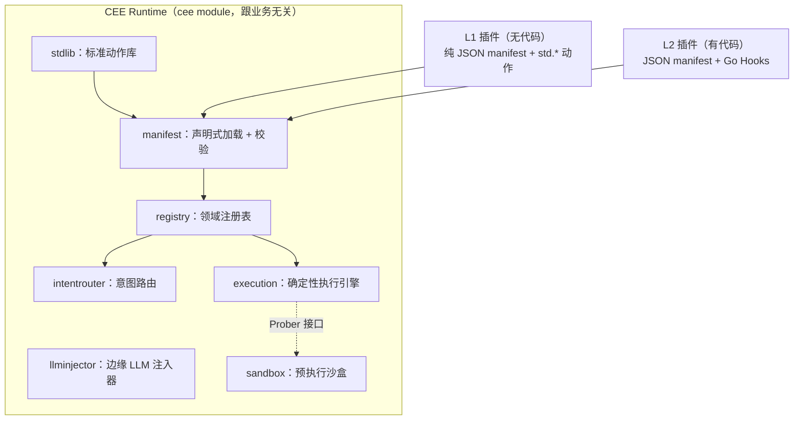

# CEE — Cognitive Execution Engine

> English: [README.en.md](README.en.md)

> 认知执行引擎：把智能体从"概率试错"拉回"确定性工程"。
> A business-agnostic protocol for deterministic-first agent execution, where the LLM is an edge tool — not the driver.

[](https://github.com/p0nymc1/cee/actions/workflows/ci.yml)

> **想先看它真的能跑？** 点上面的徽章进入最近一次 CI 运行，页面上有一份自动生成的
> **run report**：三个场景的完整执行输出、每个 Step 的 trace、插件排行榜、七份 manifest 的
> 校验结果——全部由 GitHub runner 在干净机器上真实执行产生，不是文档里手写的。

> 想了解设计动机、现状与路线图：[**技术白皮书**](docs/WHITEPAPER.md)（技术评审用）· [**路演版**](docs/PITCH.md)（十页，先讲问题再讲架构）。
> 两份文档里每个数字都可由 `cee bench` 或 CI 复现，未实测的指标一律标注为目标值。

## 先看这一件事

这是别的方案给不了的能力，也是理解 CEE 最快的入口——**改一条规则之前，先算出它会改变过去哪些决定**：

```bash
go run ./examples/rule_change
```
```
上季度，在当时生效的规则下（≤ $100 自动放行）：
  37 笔退款 —— 29 笔放行，8 笔挂起

提议：把限额收紧到 $50。拿同样这 37 笔重放：

  37 笔里有 15 笔决定翻转

    r-0005   $63     paid -> held
    r-0006   $95     paid -> held
    ...

  另有 6 笔之前挂起、现在仍然挂起。结论不变，只是给运维的理由变了。
```

风控调参、阈值收紧、策略变更，今天普遍是"改完上线看看"。这里变成**改之前先看**。

Agent 做不到这件事，不是因为不够聪明，而是**它的计划只在执行过程中存在**，没有可供检验的对象。Temporal 有持久化重试、Airflow 有调度，但"算出这次改动会翻转哪些历史决定"只有确定性引擎做得到。

有个细节值得注意：上面有一笔金额落在翻转区间里却没有翻转——因为**探针的裁决来自录像而不是实时检查**，当时已关闭的账户现在仍然是关闭的。变的只有规则本身。实现见 [`replay`](replay/replay.go)。

---

CEE 不是一个针对某个行业的应用，而是一套**跟业务无关的确定性执行协议**。它的赌注很简单：大多数被塞进"智能体"里的业务流程，本质上路径明确、不需要 LLM 每一步做决策；真正需要 LLM 的地方，只有"把非结构化输入转成结构化字段"这一件事。

于是 CEE 把主控权交还给一台确定性状态机，LLM 被降级为一个**只做抽取、不做决策**的边缘工具。任何行业都可以把自己的流程作为"领域插件"接进来，而引擎代码一行都不用改。

- **零外部依赖**：整个模块只用 Go 标准库，`go build` / `go test` 在无网络环境下也能跑。
- **无代码也能贡献**：一份 JSON manifest + 标准动作库，不会 Go 的人也能发布一个能跑、且被自动校验合格的插件。
- **比 Agent 高效是可测的**：每次执行都能产出一份 Scorecard，用一个诚实的基线（朴素 Agent = 每步一次 LLM 调用）算出"省掉了多少次 LLM 调用"。

## 为什么

当前把 LLM 当全程决策者的智能体，在长周期、高并发、成本敏感的企业场景里有四个硬伤：简单任务也烧掉大量 token；随机性导致执行像黑盒、易陷死循环；上下文窗口撑不起跨周期的复杂任务；只能"事后反思"来纠错。CEE 的回应是把这四件事分别交给四个各司其职的部件，而不是指望一个更聪明的模型。

## 架构



四个核心部件的分工：

| 部件 | 一句话职责 | 守住的红线 |
|---|---|---|
| **意图路由**（`intentrouter`） | 把自然语言匹配到某个领域预注册的意图；命中就零 token 直达执行 | 匹配不到就明确返回 unmatched，绝不猜 |
| **确定性执行引擎**（`execution`） | 按 Step DAG 走流程，调用沙盒门禁、执行断路器兜底 | 没有隐式重试；结构性成环有上限保护，不由断路器吞 |
| **边缘 LLM 注入器**（`llminjector`） | 仅把非结构化文本抽成结构化字段 | 输出被裁剪到 schema 声明的字段，决策字段无法混进来 |
| **预执行沙盒**（`sandbox`） | 在执行有副作用的 Step 前先模拟一次，异常就走断路器 | 探针只读/模拟，不允许有真实副作用 |

完整设计见 [`docs/TECHNICAL_SPECIFICATION.md`](docs/TECHNICAL_SPECIFICATION.md)。

## 接入你自己的系统

**CEE 是一个库，不是一个服务。** 仓库里没有任何东西监听端口——你已有的 HTTP handler 或消息消费者调 `engine.Run(...)` 拿结果，引擎是活在你进程里的一台状态机，不是你要额外部署的东西。

```bash
go get github.com/p0nymc1/cee@v0.1.0
```

依赖树就两行：你自己 + CEE。核心模块**零第三方依赖**。

完整可运行的最小接入见 [`examples/quickstart`](examples/quickstart/main.go)（一个退款台：小额自动放行、大额挂起等经理、账户已关闭则根本不放款）。它跟仓库一起编译和测试，所以不会腐烂成一段编译不过的片段。

```bash
go run ./examples/quickstart
```
```
acct-100  $20     -> paid
acct-100  $500    -> parked for a manager (pointer …)
acct-991  $20     -> held: account acct-991 is closed; the refund would bounce
```

三种结果里只有第一种是普通控制流，另外两种是 CEE 存在的理由：

- **挂起不是失败**。等经理审批时流程存档、返回一个恢复指针，断路器不会看到它；决定到达后 `engine.Resume(pointer, ...)` 从中断处继续。换成 `filestore.New(dir)` 就能跨进程重启存活。
- **探针在动作之前跑**。账户已关闭这件事是在放款**执行前**被只读探针拦下的，钱根本没动，且拒绝原因会带给运维：

```go
sb.RegisterProbe("refund.account_open", func(ctx map[string]any) (bool, string, error) {
    if closedAccounts[ctx["account"].(string)] {
        return false, "account is closed; the refund would bounce", nil
    }
    return true, "", nil
})
```

接入建议按这个顺序：挑一个你半夜会担心的不可逆操作 → 包成 workflow → 给它加探针 → **故意让探针拒绝一次，亲眼确认动作没执行**。最后一步比读任何文档都能说明这东西在干什么。

### 什么时候不该用

流程真的需要开放式推理时不该用——CEE 整套设计就是不让模型做决定，那种场景它只会碍事。只想跑定时任务是 cron 的活；需要分布式持久化编排和重试语义是 Temporal 的活，CEE 不做这个。

### 现在还缺的

- **挂起没有尽头**：缺 TTL 与超时转派，等不到人的审批会一直挂着。
- **身份源要自己接**：`httpapi` 提供 `Identify` 钩子、引擎侧的 audience + `Authorizer` 授权已就位（默认拒绝、拒绝不消耗指针），但把它接到真实 JWT / mTLS / 会话上是接入方的事，仓库里还没有参考实现。
- **L2 插件不能热加载**：需要 Go hook 的插件要编译进你的二进制，改了得重新发版；只有纯 JSON 的 L1 插件能当数据分发。

## 本地跑起来看看

需要 **Go 1.26+**——`go.mod` 声明的是 `go 1.26.5`，这是硬下限，更低的工具链会拒绝构建（或按 `GOTOOLCHAIN` 自动下载 1.26，那就需要联网）。想在完全断网的机器上构建，请先确认本机 Go ≥ 1.26。

```bash
go build ./... && go vet ./... && go test ./...
```

```bash
go run ./examples/crypto_surveillance   # 实时行情异常监控（会联网）
go run ./examples/network_detection      # ATT&CK 匹配 + 处置爆炸半径护栏
go run ./examples/human_approval         # L1 零 Go：挂起/恢复
go run ./examples/meta_scenarios         # 工单路由 / 调度 / 数据同步
go run ./examples/rule_change            # 改一条规则，算出哪些历史决定会翻转
```

每个示例的真实输出都在 **https://p0nymc1.github.io/cee/** 上，由 CI 每小时重跑生成——不是手写的。站点有三部分：

| 页面 | 内容 |
|---|---|
| [实证页](https://p0nymc1.github.io/cee/) | 每个场景的完整执行输出，全部是捕获的真实输出 |
| [插件排行榜](https://p0nymc1.github.io/cee/leaderboard/) | 由 `cee bench` 生成的确定性榜单，含度量口径与"这个数字不是什么"的说明 |
| [博客](https://p0nymc1.github.io/cee/blog/) | 设计决策记录，包括做错的那些 |

站点由 `.github/site`（独立 module，不进核心）生成，本地跑 `make site` 可复现。

## 安装（把 cee 装成系统命令）

一键安装 `cee` 命令行工具（二选一，都只用 Go 工具链）：

```bash
make install     # 或者：
./install.sh
```

两者都是 `go install ./cmd/cee`，把二进制装到你的 Go bin（`GOBIN`，或 `GOPATH/bin`）。如果那个目录不在 `PATH` 里，脚本会打印需要加的那一行。装好后就能直接 `cee ...` 而不用 `go run`。

其他常用 `make` 目标：

| 目标 | 作用 |
|---|---|
| `make build` | 产物到 `./bin/cee` |
| `make test` | 核心 + 卫星全测 |
| `make lint` | gofmt + vet + catalog 校验 |
| `make bench` | 插件确定性排行榜 |
| `make serve MANIFEST=<路径> ADDR=<host:port>` | 本地起 HTTP 试跑一份 manifest（默认 sla-guard；仅 loopback、无认证、内存态） |
| `make draft DESC="<描述>"` | 用模型起草一份 workflow（需 `CEE_LLM_BASE_URL`/`CEE_LLM_MODEL` 环境变量） |
| `make stats` | 打印文档里引用的仓库数字（行数/包数/测试数/依赖数），文档不手写数字 |
| `make site` | 本地构建发布站点到 `./site`（先跑一遍示例，再生成实证页/排行榜/博客） |
| `make uninstall` / `make clean` | 卸载 / 清理产物 |

`make` 无参数列出全部目标。`make serve` 起来后可以直接 curl：

```bash
make serve ADDR=127.0.0.1:8899 &
curl -s http://127.0.0.1:8899/v1/run \
  -d '{"workflow":"sla-guard.evaluate","context":{"response_minutes":30}}'
# -> {"status":"completed","output":{"sla_met":true,...},"trace":["check_response_time","within_sla"]}
```

## 命令行工具

装好后把下面的 `go run ./cmd/cee` 换成 `cee` 即可；未安装时也能直接 `go run`：

```bash
go run ./cmd/cee validate <manifest.json>   # 静态校验单个 manifest（CI 门禁）
go run ./cmd/cee lint      [catalog_dir]     # 校验整个 catalog 的完整性
go run ./cmd/cee list      [catalog_dir]     # 列出 catalog 里的插件
go run ./cmd/cee install   <name> [dir]      # 先校验再落盘，把插件 manifest 拉到 ./plugins
go run ./cmd/cee bench     [catalog_dir]     # 跑基准，输出确定性排行榜
go run ./cmd/cee draft     "<描述>"          # 用模型起草一份 workflow（需配 LLM 端点）
go run ./cmd/cee serve     <manifest.json>   # 本地起 HTTP 端点试跑（仅 loopback、无认证）
```

`cee bench` 的输出就是社区飞轮——把"比 Agent 高效"变成可攀比的榜单：

```
rank plugin           determinism  events   errors   LLM calls eliminated vs agent
1    access-review    100%         4        0        8 of 8
2    sla-guard        100%         4        0        8 of 8
```

## 无代码贡献一个插件（L1）

不会 Go 也能发布插件——DAG 的"形状"是纯 JSON，行为来自标准动作库（`std.set` / `std.require` / `std.rule_check` / `std.suspend`）。引擎没有 if/else 原语，分支靠 `std.require`：条件成立走 `on_success`，不成立则失败、经断路器路由到 fallback。

```json
{"step_id": "check_threshold", "type": "leaf", "action_ref": "std.require",
 "with": {"field": "amount", "op": "lte", "value": 10000},
 "circuit_breaker_policy_ref": "route_to_flag", "on_success": "approve"}
```

要写自定义逻辑（碰外部系统等）就升到 L2：manifest 里的 `action_ref` 指向一个具名 Go 函数（`manifest.Hooks`）。两级可以在同一份 manifest 里混用。完整教程见 [`docs/DEVELOPMENT_GUIDE.md`](docs/DEVELOPMENT_GUIDE.md)，贡献规则见 [`docs/NORMATIVE_HANDBOOK.md`](docs/NORMATIVE_HANDBOOK.md) 和 [`CONTRIBUTING.md`](CONTRIBUTING.md)。

## 项目结构

```
entities/       跨部件的固定数据契约
intentrouter/    意图路由（域隔离；默认词汇匹配，可 SetVectorizer 升级为语义匹配）
embedhttp/       真实语义匹配后端：仅用 net/http 打 embedding 端点（零依赖），产出 Vectorizer
execution/       确定性执行引擎（DAG / 沙盒门禁 / 断路器 / 挂起恢复 / 失控上限）
filestore/       可持久化的挂起状态存储（文件后端，重启不丢；默认内存态在 execution 内）
llminjector/     边缘 LLM 抽取（schema 裁剪）
llmhttp/         真实 LLM 后端：仅用 net/http 打 OpenAI 兼容端点（零依赖，可接 DeepSeek/Qwen/本地 vLLM）
sandbox/         预执行沙盒
registry/        领域注册表
stdlib/          标准动作库（无代码贡献层的地基）
manifest/        JSON 声明式加载器 + 静态校验器
replay/          录制与重放：改一条规则，算出哪些历史决定会翻转
draft/           用模型起草 manifest（设计时推理一次，四道闸门把关）
httpapi/         可挂载的 http.Handler（默认拒绝匿名；恢复指针只走 body，不进 URL）
scorecard/       单次请求度量（vs 朴素 Agent 基线）
bench/           基准跑批 + 排行榜
catalog/         社区分发层（index.json + plugins/），自带两个 L1 样例
cmd/cee/         命令行工具
examples/        八个可运行范例（quickstart / rule_change / network_detection / crypto_surveillance /
                 human_approval / meta_scenarios / security_monitoring / local_netwatch）
satellites/      可选卫星 module（各自独立 go.mod）：dockersandbox（本地容器沙盒）、
                 httpsandbox（远程/云沙盒）、wasmhooks（不可信代码信任边界）
docs/            技术说明书 / 开发文档 / 规范性开发手册
```

## 现状与非目标

这是一个**协议先行**的实现：四个部件的公开 API 已经稳定，用来验证协议本身。以下是**刻意还没做**的，避免误解：

- **部分后端仍是最小内存态实现**：沙盒是进程内模拟而非 E2B/Docker。这些都藏在接口后面，替换实现不动引擎代码。（**已经落地的真实后端,全部零依赖、纯 `net/http`**：`llmhttp` 打 OpenAI 兼容端点做真实 LLM 抽取；`embedhttp` 打 embedding 端点做真实语义意图匹配（`router.SetVectorizer` 即可从词汇匹配升级）；`filestore` 提供可持久化的挂起状态，重启不丢。）
- **Scorecard 还没有真实 token 维度**：目前度量的是操作计数（确定性步数 / LLM 调用次数），`DeterminismRatio` 在"每步一次 LLM"基线下真实成立，但还没有真实 token 数、也没有 Agent 实跑对照组。
- **catalog 只分发 L1**：需要 Go Hook 的 L2 插件走 Go module 分发。

## 可选卫星 module（保住主库零依赖的方式）

需要重型后端（容器运行时、E2B SDK、WASM 运行时）的组件，**不进主库**——它们住在 `satellites/` 下、各自有独立的 `go.mod`。因为 `go build ./...` 不会进入带自己 `go.mod` 的子目录，这些依赖永远到不了核心；主库的 `go.mod` 保持零 `require`。卫星通过和内置实现**完全相同的接口**插进引擎，所以引擎一行不改。

三个已落地的卫星，覆盖两个**不同**的扩展点，证明这个模式能推广：

- **`satellites/dockersandbox`**（实现 `execution.Prober`）：本地容器预执行沙盒，把候选命令丢进一次性、无网络的 Docker 容器里预演，退出码非零就判不健康、由断路器接管。`TestSatellitePlugsIntoTheEngineUnchanged` 证明它无缝当引擎的沙盒。
- **`satellites/httpsandbox`**（实现 `execution.Prober`）：同一个接口的**远程/云**形态，把预演请求打到一个 HTTP 沙盒服务（E2B、Modal，或你自己的 runner）。宿主机不需要容器运行时，只需要网络。
- **`satellites/wasmhooks`**（实现 `execution.Action`，即 manifest Hook）：**不可信第三方代码的信任边界**。让插件行为是一段 WebAssembly，只能拿到 step context 的 JSON、只能返回 JSON，碰不到宿主的文件系统/网络/内存。信任边界契约、引擎集成、超时护栏、以及"不可信模块支撑真实 manifest step"的端到端路径全部离线测通；真正执行 wasm 字节码的 `Runtime`（用 wazero，纯 Go）是唯一需要联网 vendor 的一小块，说明见该目录 README。

`dockersandbox` 和 `httpsandbox` 实现的是同一个 `Prober` 接口——本地容器和云沙盒对引擎完全等价，换后端不改一行引擎代码。这正是"先定协议，再选后端"要兑现的东西。

```bash
cd satellites/dockersandbox && go test ./...   # 每个卫星独立构建、独立测试
cd satellites/httpsandbox   && go test ./...
cd satellites/wasmhooks     && go test ./...
```

这些卫星本身的依赖（若有）都住在各自的 `go.mod` 里，核心 `go.mod` 永远零 `require`。更多后端照同一样板往 `satellites/` 里加即可。

## License

[Apache License 2.0](LICENSE)
