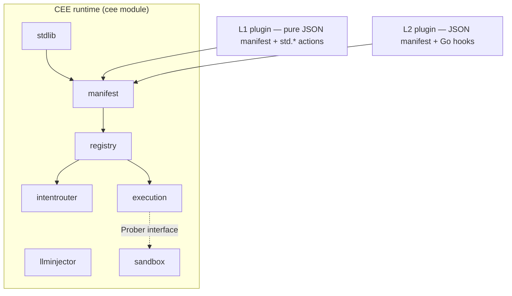

# CEE — Cognitive Execution Engine

[](https://github.com/p0nymc1/cee/actions/workflows/ci.yml)
[](https://pkg.go.dev/github.com/p0nymc1/cee)
[](https://goreportcard.com/report/github.com/p0nymc1/cee)
[](go.mod)
[](LICENSE)

A business-agnostic, deterministic-first execution protocol. A deterministic state machine drives execution; the LLM
is an edge tool that turns unstructured input into structured fields and makes no flow decisions. Domains plug in as
manifests or Go hooks without changing engine code.

- **Zero external dependencies** — core module uses only the Go standard library; `go build` / `go test` run offline.
- **No-code plugins** — a JSON manifest plus the standard action library is enough to ship a validated plugin.
- **Measured, not asserted** — every run emits a scorecard; a leaderboard ranks plugins by model calls eliminated.

## Architecture



| Component | Responsibility | Invariant |
|---|---|---|
| `intentrouter` | Natural language → pre-registered intent, per-domain | Unmatched returns explicitly; never guesses |
| `execution` | Walk the step DAG: sandbox gating, breakers, suspend/resume, compensation, fan-out/fan-in | No implicit retries; structural cycles hit a ceiling, not a breaker |
| `llminjector` | Text → structured fields only | Output clipped to the schema's declared fields |
| `sandbox` | Rehearse a side-effecting step before it runs | Probes are read-only/simulated |

Step kinds: `LeafStep` (atomic action), `CompositeStep` (named sub-workflow), `ParallelStep` (branches run
concurrently, join in declaration order). Full design: [`docs/TECHNICAL_SPECIFICATION.md`](docs/TECHNICAL_SPECIFICATION.md).

## Requirements

- **Go 1.26+** — `go.mod` declares `go 1.26.5` (a hard floor since Go 1.21). Offline builds need Go ≥ 1.26 locally.
- No `require` entries in the core `go.mod`.

## Build and test

```bash
go build ./... && go vet ./... && go test ./...
```

## Use it as a library

CEE is a library, not a service. Your existing handler calls `engine.Run(...)`; nothing listens on a port by default.

```bash
go get github.com/p0nymc1/cee@v0.1.0
```

- [`examples/quickstart`](examples/quickstart/main.go) — minimal refund desk (pay / park for a manager / probe blocks a closed account).
- Suspend/resume — a run that waits returns a resume pointer; `engine.Resume(pointer, ...)` continues. `filestore.New(dir)` persists across restarts.
- Pre-execution probe — a read-only probe runs before the action; refusal routes to a fallback and no side effect happens.

## Run the examples

```bash
go run ./examples/rule_change            # replay past decisions against a changed rule; report which flip
go run ./examples/code_audit             # AI PR-review agent re-cast: extract-only model + verified-severity + blast-radius gate
go run ./examples/quickstart             # refund desk
go run ./examples/network_detection      # ATT&CK matching + blast-radius guardrails
go run ./examples/security_monitoring    # probe gating + scorecard + aggregate diagnostics
go run ./examples/human_approval         # L1, zero Go: suspend / resume
go run ./examples/meta_scenarios         # ticket routing / scheduling / data sync
go run ./examples/crypto_surveillance    # live market anomaly screening (network)
go run ./examples/local_netwatch         # local outbound connection screening
```

Published output (regenerated by CI):

| Page | Content |
|---|---|
| [p0nymc1.github.io/cee](https://p0nymc1.github.io/cee/) | Full execution output per scenario, all captured |
| [/playground](https://p0nymc1.github.io/cee/playground/) | Edit a policy in the browser and see which past decisions flip — the engine compiled to WebAssembly, no install |
| [/leaderboard](https://p0nymc1.github.io/cee/leaderboard/) | Plugins ranked by `cee bench` |
| [/blog](https://p0nymc1.github.io/cee/blog/) | Design notes |

## Install the CLI

```bash
make install      # or: ./install.sh   (both: go install ./cmd/cee)
```

```bash
cee validate <manifest.json>   # statically validate one manifest (CI gate)
cee diff <before> <after> <events>  # replay past decisions against a changed policy
cee lint      [catalog_dir]    # validate an entire catalog
cee list      [catalog_dir]    # list catalog plugins
cee install   <name> [dir]     # validate, then write manifest into ./plugins
cee bench     [catalog_dir]    # run benchmarks, print the leaderboard
cee draft     "<description>"  # have a model draft a workflow (needs an LLM endpoint)
cee serve     <manifest.json>  # serve an HTTP endpoint locally (loopback only, no auth)
```

## Make targets

| Target | Action |
|---|---|
| `make build` | Binary to `./bin/cee` |
| `make test` | Core + satellites |
| `make lint` | gofmt + vet + catalog validation |
| `make bench` | Plugin determinism leaderboard |
| `make serve MANIFEST=<path> ADDR=<host:port>` | Serve a manifest over HTTP (loopback, no auth, in-memory) |
| `make draft DESC="<description>"` | Draft a workflow (needs `CEE_LLM_BASE_URL` / `CEE_LLM_MODEL`) |
| `make stats` | Print the repo figures the docs quote |
| `make site` | Build the published site into `./site` |
| `make playground` | Compile the engine to WebAssembly for the browser playground |
| `make uninstall` / `make clean` | Uninstall / clean artifacts |

## Author a plugin

L1 (no code) — the DAG shape is JSON; behaviour comes from the standard action library (`std.set` / `std.require` /
`std.rule_check` / `std.suspend` / `std.require_verified`). The engine has no if/else; branch via `std.require`
(condition holds → `on_success`, else the breaker routes to a fallback):

```json
{"step_id": "check_threshold", "type": "leaf", "action_ref": "std.require",
 "with": {"field": "amount", "op": "lte", "value": 10000},
 "circuit_breaker_policy_ref": "route_to_flag", "on_success": "approve"}
```

L2 (code) — point `action_ref` at a named Go function (`manifest.Hooks`). Both tiers mix in one manifest. See
[`docs/DEVELOPMENT_GUIDE.md`](docs/DEVELOPMENT_GUIDE.md), [`docs/NORMATIVE_HANDBOOK.md`](docs/NORMATIVE_HANDBOOK.md),
[`CONTRIBUTING.md`](CONTRIBUTING.md).

## Project layout

```
entities/        fixed cross-component data contracts
intentrouter/    intent routing (lexical by default; SetVectorizer → semantic)
embedhttp/       embedding-endpoint Vectorizer (net/http, zero dependencies)
execution/       deterministic engine (DAG / gating / breakers / suspend-resume / compensation / parallel)
filestore/       durable Store for suspended state
llminjector/     edge LLM extraction (schema clipping)
llmhttp/         OpenAI-compatible extractor backend (net/http, zero dependencies)
sandbox/         pre-execution sandbox
registry/        domain registry
stdlib/          standard action library
manifest/        declarative JSON loader + static validator
replay/          record/replay; compute which past decisions a rule change flips
policydiff/      diff two versions of a policy over historical inputs
draft/           model-drafted manifests behind four validation gates
httpapi/         mountable http.Handler (anonymous denied by default)
scorecard/       per-request metrics
diagnostics/     cross-run error metrics (intent miss / probe refusal / escalation)
bench/           benchmark batches + leaderboard
catalog/         community distribution (index.json + plugins/)
cmd/cee/         command-line tool
cmd/ceewasm/     WebAssembly bridge for the browser playground (js/wasm build tag)
examples/        nine runnable examples, compiled and tested with the repo
satellites/      optional modules, each own go.mod: dockersandbox / httpsandbox / wasmhooks
docs/            specification / development guide / normative handbook
```

## Satellites

Heavyweight backends live under `satellites/`, each with its own `go.mod`. `go build ./...` does not descend into
them, so their dependencies cannot reach the core, which stays at zero `require`. They plug in through the same
interfaces as the built-in implementations.

- `dockersandbox` — `execution.Prober` over a local throwaway container.
- `httpsandbox` — `execution.Prober` over a remote/cloud sandbox service.
- `wasmhooks` — `execution.Action` as WebAssembly; a trust boundary for untrusted third-party code.

```bash
cd satellites/dockersandbox && go test ./...
cd satellites/httpsandbox   && go test ./...
cd satellites/wasmhooks     && go test ./...
```

## Current limitations

- Built-in sandbox is an in-process simulation; container/cloud isolation is via satellites.
- Suspension has no TTL or timeout escalation.
- Registration is guarded by a lock but there is no runtime hot-loading of manifests.
- `diagnostics` counters are in-memory; there is no metrics endpoint or time-series export.
- Scorecard measures operation counts, not real token consumption; there is no live agent control group.
- Catalog distributes L1 only; L2 plugins ship as Go modules.

## License

[Apache License 2.0](LICENSE)
