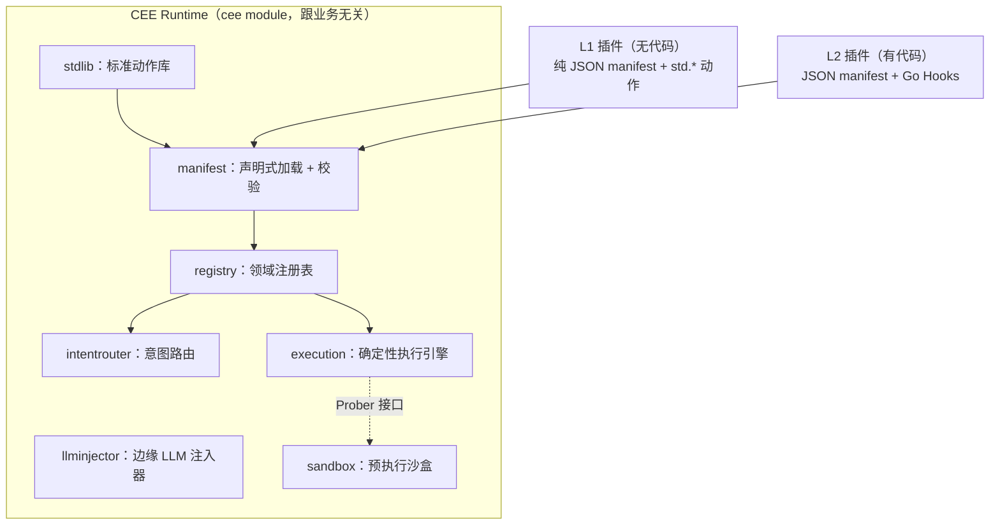

# CEE — Cognitive Execution Engine

> 认知执行引擎：把智能体从"概率试错"拉回"确定性工程"。
> A business-agnostic protocol for deterministic-first agent execution, where the LLM is an edge tool — not the driver.

[](https://github.com/p0nymc1/cee/actions/workflows/ci.yml)

> **想先看它真的能跑？** 点上面的徽章进入最近一次 CI 运行，页面上有一份自动生成的
> **run report**：三个场景的完整执行输出、每个 Step 的 trace、插件排行榜、七份 manifest 的
> 校验结果——全部由 GitHub runner 在干净机器上真实执行产生，不是文档里手写的。

CEE 不是一个针对某个行业的应用，而是一套**跟业务无关的确定性执行协议**。它的赌注很简单：大多数被塞进"智能体"里的业务流程，本质上路径明确、不需要 LLM 每一步做决策；真正需要 LLM 的地方，只有"把非结构化输入转成结构化字段"这一件事。

于是 CEE 把主控权交还给一台确定性状态机，LLM 被降级为一个**只做抽取、不做决策**的边缘工具。任何行业都可以把自己的流程作为"领域插件"接进来，而引擎代码一行都不用改。

- **零外部依赖**：整个模块只用 Go 标准库，`go build` / `go test` 在无网络环境下也能跑。
- **无代码也能贡献**：一份 JSON manifest + 标准动作库，不会 Go 的人也能发布一个能跑、且被自动校验合格的插件。
- **比 Agent 高效是可测的**：每次执行都能产出一份 Scorecard，用一个诚实的基线（朴素 Agent = 每步一次 LLM 调用）算出"省掉了多少次 LLM 调用"。

## 为什么

当前把 LLM 当全程决策者的智能体，在长周期、高并发、成本敏感的企业场景里有四个硬伤：简单任务也烧掉大量 token；随机性导致执行像黑盒、易陷死循环；上下文窗口撑不起跨周期的复杂任务；只能"事后反思"来纠错。CEE 的回应是把这四件事分别交给四个各司其职的部件，而不是指望一个更聪明的模型。

## 架构



四个核心部件的分工：

| 部件 | 一句话职责 | 守住的红线 |
|---|---|---|
| **意图路由**（`intentrouter`） | 把自然语言匹配到某个领域预注册的意图；命中就零 token 直达执行 | 匹配不到就明确返回 unmatched，绝不猜 |
| **确定性执行引擎**（`execution`） | 按 Step DAG 走流程，调用沙盒门禁、执行断路器兜底 | 没有隐式重试；结构性成环有上限保护，不由断路器吞 |
| **边缘 LLM 注入器**（`llminjector`） | 仅把非结构化文本抽成结构化字段 | 输出被裁剪到 schema 声明的字段，决策字段无法混进来 |
| **预执行沙盒**（`sandbox`） | 在执行有副作用的 Step 前先模拟一次，异常就走断路器 | 探针只读/模拟，不允许有真实副作用 |

完整设计见 [`docs/TECHNICAL_SPECIFICATION.md`](docs/TECHNICAL_SPECIFICATION.md)。

## 快速开始

需要 Go 1.22+（仓库按 1.26 工具链开发，语法向下兼容到 1.22）。

```bash
go build ./...     # 编译全部包
go test ./...       # 跑全部测试
go vet ./...
```

跑两个端到端范例，直接看到实时 Scorecard：

```bash
# L2（有 Go 代码）：网络安全监测 —— 意图匹配 ATT&CK、沙盒门禁、断路器降级人工审批
go run ./examples/security_monitoring

# L1（零 Go 代码）：审批流挂起/恢复 —— 整条流程就是一份 JSON manifest
go run ./examples/human_approval
```

`security_monitoring` 的输出片段：

```
matched technique security.T1110_brute_force (confidence 0.62) -> entering workflow security.contain_threat
outcome: containment held for human approval (breaker downgraded, critical asset protected)
scorecard[...]: determinism 100% (2 deterministic steps, 0 LLM calls), 1 sandbox probes, 1 breaker trips; vs a per-step agent this eliminated 2 LLM calls
```

## 命令行工具

```bash
go run ./cmd/cee validate <manifest.json>   # 静态校验单个 manifest（CI 门禁）
go run ./cmd/cee lint      [catalog_dir]     # 校验整个 catalog 的完整性
go run ./cmd/cee list      [catalog_dir]     # 列出 catalog 里的插件
go run ./cmd/cee install   <name> [dir]      # 先校验再落盘，把插件 manifest 拉到 ./plugins
go run ./cmd/cee bench     [catalog_dir]     # 跑基准，输出确定性排行榜
```

`cee bench` 的输出就是社区飞轮——把"比 Agent 高效"变成可攀比的榜单：

```
rank plugin           determinism  events   errors   LLM calls eliminated vs agent
1    access-review    100%         4        0        8 of 8
2    sla-guard        100%         4        0        8 of 8
```

## 无代码贡献一个插件（L1）

不会 Go 也能发布插件——DAG 的"形状"是纯 JSON，行为来自标准动作库（`std.set` / `std.require` / `std.rule_check` / `std.suspend`）。引擎没有 if/else 原语，分支靠 `std.require`：条件成立走 `on_success`，不成立则失败、经断路器路由到 fallback。

```json
{"step_id": "check_threshold", "type": "leaf", "action_ref": "std.require",
 "with": {"field": "amount", "op": "lte", "value": 10000},
 "circuit_breaker_policy_ref": "route_to_flag", "on_success": "approve"}
```

要写自定义逻辑（碰外部系统等）就升到 L2：manifest 里的 `action_ref` 指向一个具名 Go 函数（`manifest.Hooks`）。两级可以在同一份 manifest 里混用。完整教程见 [`docs/DEVELOPMENT_GUIDE.md`](docs/DEVELOPMENT_GUIDE.md)，贡献规则见 [`docs/NORMATIVE_HANDBOOK.md`](docs/NORMATIVE_HANDBOOK.md) 和 [`CONTRIBUTING.md`](CONTRIBUTING.md)。

## 项目结构

```
entities/       跨部件的固定数据契约
intentrouter/    意图路由（域隔离；默认词汇匹配，可 SetVectorizer 升级为语义匹配）
embedhttp/       真实语义匹配后端：仅用 net/http 打 embedding 端点（零依赖），产出 Vectorizer
execution/       确定性执行引擎（DAG / 沙盒门禁 / 断路器 / 挂起恢复 / 失控上限）
filestore/       可持久化的挂起状态存储（文件后端，重启不丢；默认内存态在 execution 内）
llminjector/     边缘 LLM 抽取（schema 裁剪）
llmhttp/         真实 LLM 后端：仅用 net/http 打 OpenAI 兼容端点（零依赖，可接 DeepSeek/Qwen/本地 vLLM）
sandbox/         预执行沙盒
registry/        领域注册表
stdlib/          标准动作库（无代码贡献层的地基）
manifest/        JSON 声明式加载器 + 静态校验器
scorecard/       单次请求度量（vs 朴素 Agent 基线）
bench/           基准跑批 + 排行榜
catalog/         社区分发层（index.json + plugins/），自带两个 L1 样例
cmd/cee/         命令行工具
examples/        可运行范例（security_monitoring、human_approval）
satellites/      可选卫星 module（各自独立 go.mod）：dockersandbox（真实沙盒）、wasmhooks（不可信代码信任边界）
docs/            技术说明书 / 开发文档 / 规范性开发手册
```

## 现状与非目标

这是一个**协议先行**的实现：四个部件的公开 API 已经稳定，用来验证协议本身。以下是**刻意还没做**的，避免误解：

- **部分后端仍是最小内存态实现**：沙盒是进程内模拟而非 E2B/Docker。这些都藏在接口后面，替换实现不动引擎代码。（**已经落地的真实后端,全部零依赖、纯 `net/http`**：`llmhttp` 打 OpenAI 兼容端点做真实 LLM 抽取；`embedhttp` 打 embedding 端点做真实语义意图匹配（`router.SetVectorizer` 即可从词汇匹配升级）；`filestore` 提供可持久化的挂起状态，重启不丢。）
- **Scorecard 还没有真实 token 维度**：目前度量的是操作计数（确定性步数 / LLM 调用次数），`DeterminismRatio` 在"每步一次 LLM"基线下真实成立，但还没有真实 token 数、也没有 Agent 实跑对照组。
- **catalog 只分发 L1**：需要 Go Hook 的 L2 插件走 Go module 分发。

## 可选卫星 module（保住主库零依赖的方式）

需要重型后端（容器运行时、E2B SDK、WASM 运行时）的组件，**不进主库**——它们住在 `satellites/` 下、各自有独立的 `go.mod`。因为 `go build ./...` 不会进入带自己 `go.mod` 的子目录，这些依赖永远到不了核心；主库的 `go.mod` 保持零 `require`。卫星通过和内置实现**完全相同的接口**插进引擎，所以引擎一行不改。

两个已落地的卫星，各插入引擎的**不同**扩展点，证明这个模式能推广：

- **`satellites/dockersandbox`**（实现 `execution.Prober`）：真实预执行沙盒，把候选命令丢进一次性、无网络的 Docker 容器里预演，退出码非零就判不健康、由断路器接管。`TestSatellitePlugsIntoTheEngineUnchanged` 证明它无缝当引擎的沙盒。
- **`satellites/wasmhooks`**（实现 `execution.Action`，即 manifest Hook）：**不可信第三方代码的信任边界**。让插件行为是一段 WebAssembly，只能拿到 step context 的 JSON、只能返回 JSON，碰不到宿主的文件系统/网络/内存。信任边界契约、引擎集成、超时护栏、以及"不可信模块支撑真实 manifest step"的端到端路径全部离线测通；真正执行 wasm 字节码的 `Runtime`（用 wazero，纯 Go）是唯一需要联网 vendor 的一小块，说明见该目录 README。

```bash
cd satellites/dockersandbox && go test ./...   # 每个卫星独立构建、独立测试
cd satellites/wasmhooks     && go test ./...
```

这两个卫星本身的依赖（若有）都住在各自的 `go.mod` 里，核心 `go.mod` 永远零 `require`。E2B/云沙盒等更多后端照同一样板往 `satellites/` 里加即可。

## License

[Apache License 2.0](LICENSE)
