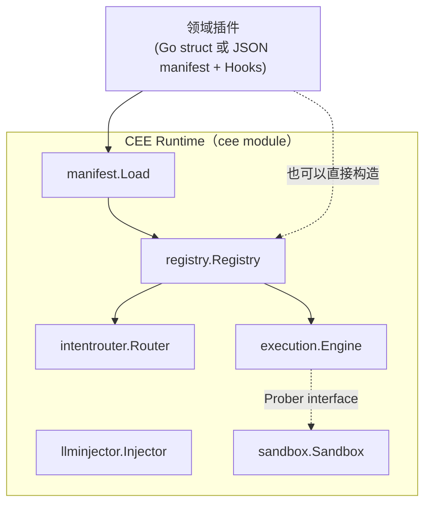
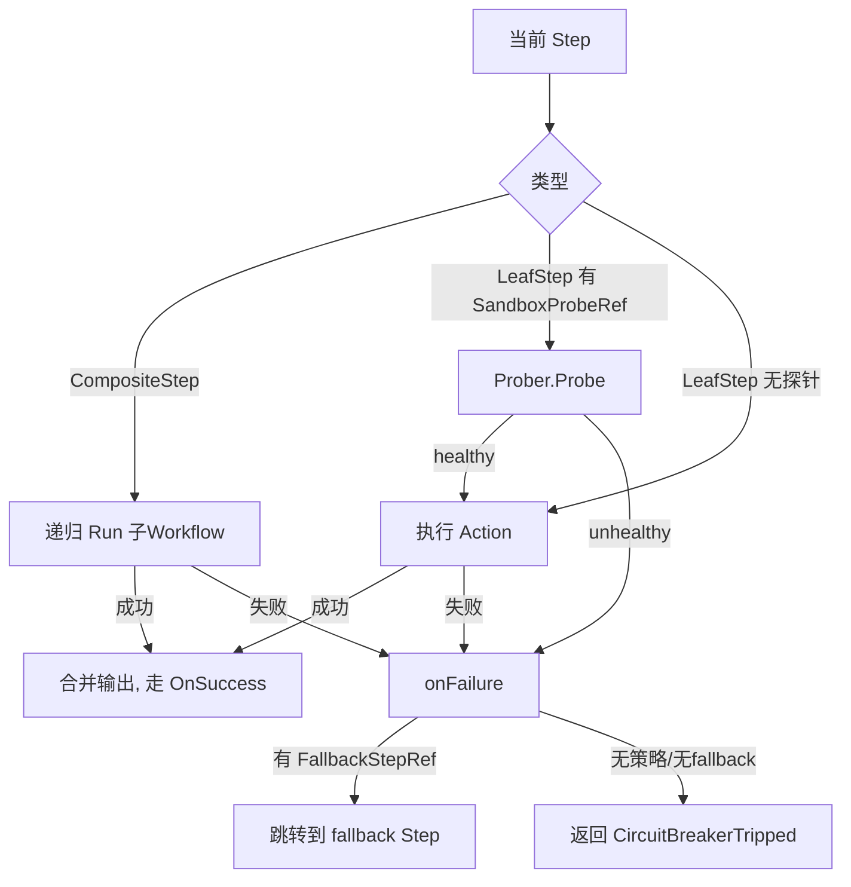

# CEE 技术说明书

版本：对应当前代码状态（`entities` / `execution` / `intentrouter` / `llminjector` / `sandbox` / `registry` / `manifest` 七个包）。本说明书只描述已经实现并通过测试的部分，不描述路线图中尚未落地的内容（见第 8 节）。

## 1. 产品定位

CEE（Cognitive Execution Engine，认知执行引擎）不是一个针对某个行业的应用，而是一套**跟业务无关的确定性执行协议**。它的核心主张：

- 大多数被塞进"智能体"里的业务流程，本质上路径明确、不需要 LLM 每一步做决策；真正需要 LLM 的地方，只有"把非结构化输入转成结构化字段"这一件事。
- 引擎只认"引用"，不认业务内容——四个核心组件互相之间只交换 `entities` 包定义的固定形状（`IntentNode`、`MatchResult`、`ExtractionRequest/Result`、`ProbeRequest/Result`、`WorkflowResult`），从不传递未经约定的 map。这使得任何行业的业务逻辑都可以作为"领域插件"接入，引擎代码本身不需要改动。

## 2. 系统架构



七个包各自的职责边界：

| 包 | 职责 | 对外暴露的核心类型 |
|---|---|---|
| `entities` | 定义组件间交换的固定数据形状 | `IntentNode`、`MatchResult`、`ExtractionRequest/Result`、`ProbeRequest/Result`、`WorkflowResult` |
| `intentrouter` | 意图路由层：把自然语言匹配到某个领域预注册的意图节点 | `Router`、`NewRouter`、`RegisterNode`、`Match` |
| `execution` | 确定性执行引擎（DEE）：走 Step DAG，调用沙盒门禁、执行断路器兜底 | `Engine`、`Step`、`LeafStep`、`CompositeStep`、`Workflow`、`CircuitBreakerPolicy`、`CircuitBreakerTripped`、`Prober` |
| `llminjector` | 边缘 LLM 注入器：仅做"文本→结构化字段"抽取，输出被裁剪到 schema 声明的字段 | `Injector`、`Schema`、`FieldType`、`Extractor` |
| `sandbox` | 预执行沙盒：在真正执行有副作用的 Step 前先模拟一次 | `Sandbox`、`Probe` |
| `registry` | 领域注册表：把一个领域插件的 intents/workflows/policies 接入共享的 Router 和 Engine | `Registry`、`Domain` |
| `manifest` | 声明式加载器：把 JSON 描述的 DAG 拓扑绑定到 Go 具名函数 | `Load`、`Hooks`、`File`、`IntentSpec`、`PolicySpec`、`WorkflowSpec`、`StepSpec` |

## 3. 核心实体模型（`entities` 包）

```go
type IntentNode struct {
    NodeID, DomainID, EntryStepRef string
    Examples []string
    Metadata map[string]any
}

type MatchResult struct {
    Matched bool
    NodeRef, EntryStepRef string
    Confidence float64
}

type ExtractionRequest struct { RawText, SchemaRef, DomainID string }
type ExtractionResult struct {
    Success bool
    StructuredPayload map[string]any
    ValidationErrors []string
}

type ProbeRequest struct {
    ProbeRef, DomainID string
    StepContext map[string]any
}
type ProbeResult struct { Healthy bool; DetectedFailureMode string }

type WorkflowResult struct {
    Output map[string]any
    StatePointer string
    Trace []string
}
```

这七个类型是整个系统唯一的"跨组件契约"。新增一个领域插件、替换 `intentrouter` 的匹配算法（例如换成真正的向量检索）、或者把 `sandbox` 换成 E2B/Docker 实现，都不需要改动这些类型——这是"引擎只认引用"原则在代码层面的体现。

## 4. 意图路由层（`intentrouter`）

- `Router` 内部按 `DomainID` 分桶存储 `IntentNode`，`Match(domainID, rawText)` 只在对应桶内做匹配，**不会跨域检索**——两个领域即使用词高度相似也不会互相误命中（见 `intentrouter/router_test.go` 的 `TestMatchDoesNotLeakAcrossDomains`）。
- 当前匹配算法是**词汇 Jaccard 相似度**（`tokenize` + 集合交并比），零依赖、可在无网络环境下运行。这是一个刻意的轻量级实现：真实场景下应替换为 sentence-transformers + 向量数据库一类的语义匹配，但 `Router` 的公开 API（`RegisterNode`/`Match`）保持不变，替换只发生在内部实现。
- `Match` 返回的 `MatchResult.Matched == false` 是一个明确信号，而不是猜测——调用方应据此转向 `llminjector` 做抽取，而不是让路由层"勉强给个答案"。

## 5. 确定性执行引擎（`execution`）

### 5.1 Step 的两种形态

`Step` 接口只有两个实现，且接口方法未导出（`circuitBreakerPolicyRef() string`），意味着**只有本包内的 `LeafStep` 和 `CompositeStep` 能满足这个接口**——Step 的形态在类型系统层面就是封闭的，不存在第三种：

- `LeafStep`：原子动作，`Run Action` 字段是一段确定性代码（`func(ctx map[string]any) (map[string]any, error)`）。
- `CompositeStep`：指向一个具名子 `Workflow`（`SubWorkflowRef`），允许 DAG 嵌套复用，而不必把每个流程拍平成同一粒度。

### 5.2 执行循环

`Engine.Run(workflowRef, ctx)` 从 `Workflow.EntryStepID` 开始，逐步执行：

1. 若当前 Step 是 `CompositeStep`，递归调用 `Run(SubWorkflowRef, ctx)`；子流程失败会以 `CircuitBreakerTripped` 形式冒泡，被外层 Step 自己的断路器策略捕获。
2. 若当前 Step 是 `LeafStep` 且声明了 `SandboxProbeRef`，先调用 `Prober.Probe`；探针不健康则走断路器路径，**不会尝试执行真实动作**。
3. 探针通过（或未声明探针）后执行 `Run(ctx)`；返回的 map 与当前 context 合并（浅合并，后者覆盖前者同名 key），推进到 `OnSuccess` 指向的下一个 Step。
4. 任何失败（探针不健康 / Action 返回 error）都进入 `onFailure`：查 `CircuitBreakerPolicyRef` 指向的策略，若有 `FallbackStepRef` 则跳转过去；否则返回 `*CircuitBreakerTripped` 错误，调用方必须显式处理，**没有隐式重试**。



### 5.3 断路器是"策略引用"，不是内联字面量

`LeafStep`/`CompositeStep` 只声明一个 `CircuitBreakerPolicyRef string`；真正的 `FallbackStepRef` 定义在 `Engine.RegisterPolicy` 注册的全局策略表里。这样任何一个策略被谁引用、一共有多少个安全网，都可以从策略表一处审计，而不用扫遍所有 Step 定义。

## 6. 边缘 LLM 注入器（`llminjector`）

`Injector.Extract` 的核心行为不是"调用 LLM"，而是**过滤 LLM 的输出**：

```go
clean := make(map[string]any, len(reg.schema))
for field, wantType := range reg.schema {
    value, present := payload[field]
    ...
    clean[field] = value   // 只拷贝 schema 里声明过的字段
}
```

即使注册的 `Extractor` 函数在返回值里夹带了 schema 之外的字段（例如一个"is_fraud"这样的决策型字段），`clean` 也不会包含它——这条边界红线是接口行为本身保证的，不依赖人工审查 Extractor 的实现（见 `TestExtractionStripsUnschemaFields`）。`FieldType` 目前只支持 `FieldString`/`FieldFloat64`/`FieldBool` 三种最小可用类型。

## 7. 预执行沙盒（`sandbox`）

`Sandbox.Probe` 满足 `execution.Prober` 接口，内部只是把 `ProbeRequest.StepContext` 转发给注册的 `Probe` 函数（`func(map[string]any) (healthy bool, failureMode string, err error)`）并统一折叠成 `ProbeResult`——探针返回 Go error 和探针返回 `healthy=false` 被引擎视为同一件事，调用方只需要处理一条失败路径。当前实现是进程内直接调用，尚未接入真正的隔离环境（E2B/Docker）；`Prober` 接口保证了替换实现不影响 `execution.Engine`。

## 8. 当前范围与已知限制

以下内容**尚未实现**，属于路线图但不在当前代码里，避免与实际状态混淆：

- **Agent 兜底层**：此前讨论过"LLM 抽取连续失败后转受限 Agent 兜底"的两级升级机制，已明确决定不做，当前抽取失败直接由调用方决定下一步（通常是转人工），引擎本身不内置这一层。
- **真实后端**：`intentrouter` 的向量检索、`execution` 的分布式/持久化状态存储、`sandbox` 的进程隔离、`llminjector` 的真实 LLM 调用，目前都是本地内存态的最小实现，用于验证协议本身，尚未接入 Qdrant / Temporal / E2B / 任何 LLM API。
- **场景模板库**：白皮书里讨论过的六类元场景（异常检测、审批流、数据同步、工单路由、调度、安全监测）尚未以 `examples/` 或独立包的形式落地。
- **状态持久化**：`WorkflowResult.StatePointer` 字段已定义，但目前只是回填 `workflowRef` 字符串，没有真正对接外部存储或支持"从指针恢复执行"。
