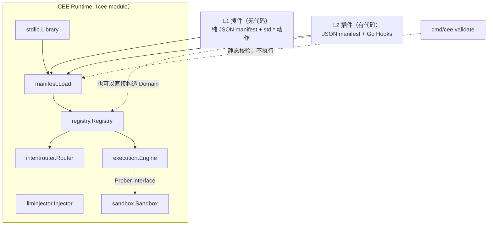
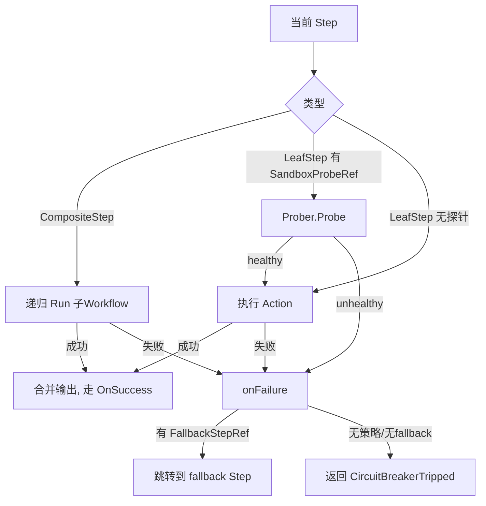

# CEE 技术说明书

版本：对应当前代码状态（`entities` / `execution` / `intentrouter` / `llminjector` / `sandbox` / `registry` / `manifest` / `stdlib` 八个库包，外加 `cmd/cee` 命令行工具）。本说明书只描述已经实现并通过测试的部分，不描述路线图中尚未落地的内容（见第 10 节）。

## 1. 产品定位

CEE（Cognitive Execution Engine，认知执行引擎）不是一个针对某个行业的应用，而是一套**跟业务无关的确定性执行协议**。它的核心主张：

- 大多数被塞进"智能体"里的业务流程，本质上路径明确、不需要 LLM 每一步做决策；真正需要 LLM 的地方，只有"把非结构化输入转成结构化字段"这一件事。
- 引擎只认"引用"，不认业务内容——四个核心组件互相之间只交换 `entities` 包定义的固定形状（`IntentNode`、`MatchResult`、`ExtractionRequest/Result`、`ProbeRequest/Result`、`WorkflowResult`），从不传递未经约定的 map。这使得任何行业的业务逻辑都可以作为"领域插件"接入，引擎代码本身不需要改动。

## 2. 系统架构



各包的职责边界：

| 包 | 职责 | 对外暴露的核心类型 |
|---|---|---|
| `entities` | 定义组件间交换的固定数据形状 | `IntentNode`、`MatchResult`、`ExtractionRequest/Result`、`ProbeRequest/Result`、`WorkflowResult` |
| `intentrouter` | 意图路由层：把自然语言匹配到某个领域预注册的意图节点 | `Router`、`NewRouter`、`RegisterNode`、`Match` |
| `execution` | 确定性执行引擎（DEE）：走 Step DAG，调用沙盒门禁、执行断路器兜底、挂起/恢复等待外部事件的流程 | `Engine`、`Step`、`LeafStep`、`CompositeStep`、`Workflow`、`CircuitBreakerPolicy`、`CircuitBreakerTripped`、`Prober`、`Suspended`、`Store`、`MemoryStore`、`State` |
| `llminjector` | 边缘 LLM 注入器：仅做"文本→结构化字段"抽取，输出被裁剪到 schema 声明的字段 | `Injector`、`Schema`、`FieldType`、`Extractor` |
| `llmhttp` | 真实 LLM 后端：仅用 `net/http` 打 OpenAI 兼容端点，产出 `llminjector.Extractor`（零依赖） | `Config`、`Extractor`、`Doer` |
| `embedhttp` | 真实语义匹配后端：仅用 `net/http` 打 embedding 端点，产出 `intentrouter.Vectorizer`（零依赖） | `Config`、`New`、`Client`、`Doer` |
| `sandbox` | 预执行沙盒：在真正执行有副作用的 Step 前先模拟一次 | `Sandbox`、`Probe` |
| `filestore` | 落盘的 `execution.Store` 实现：挂起的流程存成 JSON，跨重启存活 | `Store`、`New`、`Pending` |
| `registry` | 领域注册表：把一个领域插件的 intents/workflows/policies 接入共享的 Router 和 Engine | `Registry`、`Domain` |
| `scorecard` | 度量一次请求：确定性步数 / LLM 调用 / 沙盒预演 / 断路器次数 / 耗时，用于跟"朴素 Agent"基线对比 | `Scorecard`、`Recorder`、`NewRecorder` |
| `stdlib` | 标准动作库：骨架预置的通用确定性动作，manifest 靠纯 JSON 引用并传参，插件作者不用写 Go | `Library`、`Factory`、`Default`（含 `std.set`/`std.require`/`std.rule_check`/`std.suspend`） |
| `manifest` | 声明式加载器 + 静态校验器：把 JSON DAG 绑定到标准动作/Go 具名函数，并可在运行前静态校验引用完整性 | `Load`、`Validate`、`Report`、`Hooks`、`File`、`StepSpec` 等 |
| `catalog` | 社区分发层：git-based 插件目录（index.json + manifest 文件），支持列举/整体校验/安装/基准 | `Catalog`、`Entry`、`Load`、`Lint`、`Install`、`ReadBenchmark` |
| `bench` | 基准跑批：把一批标准事件跑过插件，聚合 Scorecard 并按确定性比率排名 | `Suite`、`Event`、`Result`、`Run`、`Leaderboard` |
| `cmd/cee` | 命令行工具：`validate` / `lint` / `list` / `install` / `bench`（均可用于 CI） | — |

## 3. 核心实体模型（`entities` 包）

```go
type IntentNode struct {
    NodeID, DomainID, EntryWorkflowRef string
    Examples []string
    Metadata map[string]any
}

type MatchResult struct {
    Matched bool
    NodeRef, EntryWorkflowRef string
    Confidence float64
}

type ExtractionRequest struct { RawText, SchemaRef, DomainID string }
type ExtractionResult struct {
    Success bool
    StructuredPayload map[string]any
    ValidationErrors []string
}

type ProbeRequest struct {
    ProbeRef, DomainID string
    StepContext map[string]any
}
type ProbeResult struct { Healthy bool; DetectedFailureMode string }

type WorkflowResult struct {
    Output map[string]any
    StatePointer string
    Trace []string
}
```

这七个类型是整个系统唯一的"跨组件契约"。新增一个领域插件、替换 `intentrouter` 的匹配算法（例如换成真正的向量检索）、或者把 `sandbox` 换成 E2B/Docker 实现，都不需要改动这些类型——这是"引擎只认引用"原则在代码层面的体现。

## 4. 意图路由层（`intentrouter`）

- `Router` 内部按 `DomainID` 分桶存储 `IntentNode`，`Match(domainID, rawText)` 只在对应桶内做匹配，**不会跨域检索**——两个领域即使用词高度相似也不会互相误命中（见 `intentrouter/router_test.go` 的 `TestMatchDoesNotLeakAcrossDomains`）。
- **默认匹配算法是词汇 Jaccard 相似度**（`tokenize` + 集合交并比），零依赖、可在无网络环境下运行——一个刻意的轻量级默认。
- **升级为语义匹配只需一行**：`router.SetVectorizer(v)` 挂上一个 `Vectorizer`（`embedhttp.New(...)` 就是一个真实的、打 embedding 端点的实现），匹配即从词汇交并比切换为**embedding 余弦相似度**——于是"unusual sign-in from a new device"能匹配到"suspicious login"，尽管两者一个词都不重合（见 `intentrouter/semantic_test.go` 的 `TestSemanticMatchAcrossVocabulary`）。这印证了第 3 节"替换匹配算法不动契约"的承诺:`RegisterNode`/`Match` 的签名一字未变。
- **example 向量惰性计算并缓存**（首次 `Match` 时算，之后只算 query）；由于 `Match` 签名没有 error 返回，若 embedding 端点报错，`Match` **降级回词汇匹配**而不是崩溃（`TestSemanticFailureDegradesToLexical`）——一个抖动的 embedding 服务不会把路由层拖垮。
- `Match` 返回的 `MatchResult.Matched == false` 是一个明确信号，而不是猜测——调用方应据此转向 `llminjector` 做抽取，而不是让路由层"勉强给个答案"。

## 5. 确定性执行引擎（`execution`）

### 5.1 Step 的两种形态

`Step` 接口只有两个实现，且接口方法未导出（`circuitBreakerPolicyRef() string`），意味着**只有本包内的 `LeafStep` 和 `CompositeStep` 能满足这个接口**——Step 的形态在类型系统层面就是封闭的，不存在第三种：

- `LeafStep`：原子动作，`Run Action` 字段是一段确定性代码（`func(ctx map[string]any) (map[string]any, error)`）。
- `CompositeStep`：指向一个具名子 `Workflow`（`SubWorkflowRef`），允许 DAG 嵌套复用，而不必把每个流程拍平成同一粒度。

### 5.2 执行循环

`Engine.Run(workflowRef, ctx)` 从 `Workflow.EntryStepID` 开始，逐步执行：

1. 若当前 Step 是 `CompositeStep`，递归调用 `Run(SubWorkflowRef, ctx)`；子流程失败会以 `CircuitBreakerTripped` 形式冒泡，被外层 Step 自己的断路器策略捕获（唯一例外是 5.4 的两个失控错误，它们绕过断路器直接向上）。
2. 若当前 Step 是 `LeafStep` 且声明了 `SandboxProbeRef`，先调用 `Prober.Probe`；探针不健康则走断路器路径，**不会尝试执行真实动作**。
3. 探针通过（或未声明探针）后执行 `Run(ctx)`；返回的 map 与当前 context 合并（浅合并，后者覆盖前者同名 key），推进到 `OnSuccess` 指向的下一个 Step。
4. 任何失败（探针不健康 / Action 返回 error）都进入 `onFailure`：查 `CircuitBreakerPolicyRef` 指向的策略，若有 `FallbackStepRef` 则跳转过去；否则返回 `*CircuitBreakerTripped` 错误，调用方必须显式处理，**没有隐式重试**。
5. 第三条出边：Action 返回 `*Suspended` 时既不算成功也不算失败，流程存档挂起、返回恢复指针，详见 5.5。



### 5.3 断路器是"策略引用"，不是内联字面量

`LeafStep`/`CompositeStep` 只声明一个 `CircuitBreakerPolicyRef string`；真正的 `FallbackStepRef` 定义在 `Engine.RegisterPolicy` 注册的全局策略表里。这样任何一个策略被谁引用、一共有多少个安全网，都可以从策略表一处审计，而不用扫遍所有 Step 定义。

### 5.4 失控上限：结构性缺陷不该由断路器兜

DAG 的形状写错时，5.2 的执行循环有两条路会失控。这两条都**不是业务失败**，因此不走断路器：

| 缺陷 | 没有上限时的后果 | 上限 | 触发的错误 |
|---|---|---|---|
| `OnSuccess` 首尾相接成环 | `Run` 无限空转，进程挂住 | `DefaultMaxSteps = 10000` | `*StepLimitExceeded` |
| `SubWorkflowRef` 指回自己/互指 | 无限递归，**Go 运行时 `fatal error: stack overflow` 直接杀掉进程，且不可 `recover`** | `DefaultMaxDepth = 64` | `*DepthLimitExceeded` |

两个上限都设得远高于任何正常流程——一次 DAG 走法通常每个 Step 最多访问一次。可以用 `Engine.SetLimits(maxSteps, maxDepth)` 调整，但**关不掉**：传入非正值只会保留默认值。理由是失控是进程级危害，不是某个工作流自己的事，不该允许单个插件把整个运行时的护栏摘掉。

`*StepLimitExceeded` 会带上 trace 的尾部（最后 10 步），环就在里面，便于直接定位。

一个刻意的设计取舍：**这两个错误绕过断路器，直接向上冒泡**。子流程失控时不查 `CircuitBreakerPolicyRef`、不跳 fallback。因为断路器的语义是"业务动作失败了，走备用路径"，而 DAG 成环是**结构缺陷**——让 fallback 吞掉它等于把 bug 藏起来，外层还可能反复重入同一个坏掉的子流程。这条边界由 `TestRunawayIsNotSwallowedByACircuitBreaker` 锁住。

上限是运行时的最后一道防线；**正常情况下这两类缺陷应该在 `cee validate` 阶段就被拦下**（见 8.4），根本走不到运行时。

### 5.5 挂起与恢复：等人不是失败

一个流程走到"要等外面某件事"（人工审批、回调、时间窗口）时，5.2 的两条出边都不合适：它没成功，但也**不是失败**——用断路器兜等于把"等待"当成"出错"，等待这件事就被静默丢掉了。

所以有第三条出边：Action 返回 `*Suspended`。

```go
// Go 里：
return execution.Suspend("awaiting human approval")
```
```json
// 无代码 manifest 里：
{"step_id": "hold_for_human", "type": "leaf", "action_ref": "std.suspend",
 "with": {"reason": "awaiting manager decision"}, "on_success": "apply_decision"}
```

用 error 作为控制信号沿用的是标准库 `fs.SkipDir` 的先例：它靠类型被识别，不是故障。引擎看到它**不查断路器、不跳 fallback、不重试**，而是：

1. 把当前 `ctx`、`trace`、挂起点的 `StepID` 和 `Reason` 存进 `Store`；
2. 生成一个 `crypto/rand` 的不可猜测指针，回填到 `WorkflowResult.StatePointer`；
3. 正常返回（`err == nil`）——挂起不是错误。

`Engine.Resume(pointer, resolution)` 把外部的决定 `resolution` 合并进存下来的 ctx，**从挂起那个 Step 的 `OnSuccess` 继续**（等待已经结束，挂起点本身不重跑）。

几条刻意的约束：

- **指针一次性**：`Resume` 在执行前就把指针从 Store 删掉。同一个审批不能被重放两次。
- **不配 `Store` 就报错**：没调 `SetStore` 时挂起直接返回 `*NoSuspensionSupport`，而不是退化成普通失败让断路器吞掉。
- **`Store` 是接口**，两个实现：`execution.MemoryStore`（进程内、并发安全、重启即丢，够开发和测试用）和 `filestore.Store`（落盘、跨重启存活）。`State` 是纯值类型、不含引擎指针，可直接序列化——换实现不动引擎，跟 `Prober` 的安排完全一致。见 5.6。
- **恢复后无需新原语做分支**：`resolution` 就是普通 context 字段，下一步用 `std.require` 比一下 `approved` 即可，失败经断路器走到"驳回"分支——复用 8.3 那套机制。

完整可运行范例：`examples/human_approval`（零 Go hook 的纯 L1 插件）。它的 trace 跨越挂起仍然是连续的一条：

```
[check_threshold hold_for_human apply_decision record_approved]
```

### 5.6 落盘的 Store（`filestore`）

`MemoryStore` 重启即丢，而"等人工审批"天然跨小时甚至跨天——一个重启就丢光待审批队列的审批流实际上没法用。`filestore.Store` 把每个挂起的流程按恢复指针存成一个 JSON 文件：

```go
store, err := filestore.New("./state")   // 目录 0700，文件 0600
engine.SetStore(store)
```

它放在独立包而不是 `execution` 里，理由跟 `sandbox` 一样：引擎只依赖 `Store` 接口，文件 I/O 不该进引擎内核。

几个实现上的决定：

- **原子写**：先写临时文件、`Sync` 落盘、再 `rename`。`rename` 在 POSIX 上是原子的，所以读者要么看到旧文件要么看到新文件，永远读不到写了一半的状态；写到一半崩溃也只是留下临时文件，原状态完好。先 `Sync` 再 `rename` 是必要的——这个 Store 存在的意义就是扛崩溃，而"改名先于内容落盘"扛不住崩溃。
- **指针即文件名，所以指针必须校验**。`Load`/`Delete` 的 pointer 是从外部来的（CLI 参数、HTTP 参数），直接当文件名用就是拿不可信输入拼路径。`checkPointer` 把它限制在 `[A-Za-z0-9_-]`，于是分隔符、`..`、NUL、绝对路径都进不来。校验的是字符集而不是"必须是 32 位十六进制"，这样引擎将来换指针格式也不会连带失效。
- **`Delete` 一个已经没有的指针要报错**，不能静默成功——引擎正是靠 `Delete` 保证审批不可重放，这里吞掉错误等于把一次重复恢复藏起来。
- **`Pending()` 跳过坏文件而不是整体失败**：一个损坏的文件不该让运维看不见其余所有待审批项。
- **权限**：目录 `0700`、文件 `0600`。挂起状态里带着业务上下文（金额、姓名、主机名），不该是全局可读的。

**一个必须知道的取舍**：`State.Ctx` 是 `map[string]any`，经 JSON 往返后**所有数字都变成 `float64`**。标准动作不受影响（`stdlib` 的比较统一走 `toFloat`），但一个 Go Hook 如果在恢复后写 `ctx["n"].(int)` 会 panic。要么断言 `float64`，要么别把非 JSON 原生类型放进会挂起的流程的 context 里。这条行为由 `TestNumbersComeBackAsFloat64` 钉住，不会悄悄改变。

### 5.7 `Consume`：把"取用"做成一个不可分割的动作

`Store` 接口上**没有 `Delete`**，取用一个指针只有一个办法：`Consume(pointer) (State, error)`，原子地"读出并移除"。

这不是因为原来的 `Load` + `Delete` 有竞态——它其实是安全的，`unlink`/`os.Remove` 本身就是原子的，两个进程同时删同一个文件只有一个成功，另一个拿到 `ENOENT` 而不会继续往下跑。**真正的风险在于这个正确性来自实现细节，而不是接口约定**：一个后来者写 Redis 或 SQL 后端时，很容易把 `Delete` 写成"删掉就行、不报告有没有删到"，那一刻"审批不可重放"就悄悄失效了，而且不会有任何东西报错。`MemoryStore` 一开始就正是这么写的。

所以接口只暴露原子操作：实现者没有机会把它拆成一对看起来没问题的调用。附带好处是网络后端少一次往返。

`filestore` 的实现是 `rename` 抢占：把 `<pointer>` 改名成 `<pointer>.<随机>.claimed`，POSIX 保证并发的 `rename` 只有一个能成功，其余拿到 `ENOENT`。读完就删掉。

`Engine.Resume` 的顺序是 **`Load`（只读校验）→ `Consume`（原子抢占）→ 执行**。用不抢占的 `Load` 先校验，是为了让"工作流已经不在注册表里了"这类情况能报错而**不销毁**存档——否则一次部署变更就会把待审批队列吃掉。

## 6. 边缘 LLM 注入器（`llminjector`）

`Injector.Extract` 的核心行为不是"调用 LLM"，而是**过滤 LLM 的输出**：

```go
clean := make(map[string]any, len(reg.schema))
for field, wantType := range reg.schema {
    value, present := payload[field]
    ...
    clean[field] = value   // 只拷贝 schema 里声明过的字段
}
```

即使注册的 `Extractor` 函数在返回值里夹带了 schema 之外的字段（例如一个"is_fraud"这样的决策型字段），`clean` 也不会包含它——这条边界红线是接口行为本身保证的，不依赖人工审查 Extractor 的实现（见 `TestExtractionStripsUnschemaFields`）。`FieldType` 目前只支持 `FieldString`/`FieldFloat64`/`FieldBool` 三种最小可用类型。

## 7. 预执行沙盒（`sandbox`）

`Sandbox.Probe` 满足 `execution.Prober` 接口，内部只是把 `ProbeRequest.StepContext` 转发给注册的 `Probe` 函数（`func(map[string]any) (healthy bool, failureMode string, err error)`）并统一折叠成 `ProbeResult`——探针返回 Go error 和探针返回 `healthy=false` 被引擎视为同一件事，调用方只需要处理一条失败路径。当前实现是进程内直接调用，尚未接入真正的隔离环境（E2B/Docker）；`Prober` 接口保证了替换实现不影响 `execution.Engine`。

## 8. 标准动作库与无代码贡献层（`stdlib` + `cmd/cee`）

前七节描述的是"引擎怎么跑"。这一节描述的是"别人怎么接进来"——两者是正交的：一个插件作者完全不需要理解 5.2 的执行循环，也能发布一个可运行的领域插件。

### 8.1 两级贡献门槛

| 层级 | 作者要会什么 | 交付物 |
|---|---|---|
| L1（无代码） | 只需写 JSON | 一份 manifest，`action_ref` 全部指向 `std.*` 标准动作 |
| L2（有代码） | 需要写 Go | manifest + `Hooks` map，标准库表达不了的逻辑写成具名 Go 函数 |

`manifest.Load(data, hooks, std)` 的绑定顺序是**标准库优先，Hooks 兜底**（见 `resolveAction`）：`action_ref` 先在 `std` 里查，查不到再查 `hooks`，两边都没有才报错。所以 L1 和 L2 可以在同一份 manifest 里混用。

### 8.2 标准动作的形态：Factory，不是 Action

标准动作注册进 `Library` 的不是 `execution.Action` 本身，而是一个 `Factory`：

```go
type Factory func(params map[string]any) (execution.Action, error)
```

`Factory` 接收该 Step 的 `"with"` 参数块，**在加载期一次性校验并绑定**，返回一个已经闭包好参数的 `Action`。这带来一个重要性质：**参数写错在 `Load` 阶段就失败，而不是流程跑到一半才炸**——和 `NORMATIVE_HANDBOOK` 第 3 节"manifest 写错应当加载时失败"是同一条原则。

当前三个内置动作：

| 动作 | 作用 | 是否影响控制流 |
|---|---|---|
| `std.set` | 把一组固定字段写进输出，用于终态/标记步骤 | 否 |
| `std.require` | 断言 `field op value`；**不满足则该 Step 失败** | 是——失败走断路器 |
| `std.rule_check` | 计算 `field op value` 的布尔结果写进 `result_field` | 否，只标注不跳转 |
| `std.suspend` | 挂起流程等待外部事件（见 5.5），需要 `reason` | 是——但既不成功也不失败，返回恢复指针 |

支持的 `op`：`eq` / `neq` / `gt` / `gte` / `lt` / `lte` / `in`。数值比较统一走 `toFloat`，所以 JSON 里的 `10000`（`float64`）和 Go 里的 `int` 能正确比较。

### 8.3 无代码怎么表达 if/else：借用断路器

引擎本身**没有 if/else 原语**，Step 只有"成功走 `OnSuccess`"和"失败走断路器"两条出边。`std.require` 正是靠这一点来表达分支：

```json
{"step_id": "check_threshold", "type": "leaf", "action_ref": "std.require",
 "with": {"field": "amount", "op": "lte", "value": 10000},
 "circuit_breaker_policy_ref": "route_to_flag", "on_success": "approve"}
```

读作："要求金额 ≤ 10000；满足则去 `approve`，不满足则由 `route_to_flag` 策略把我送去 `flag`。"

这不是把断路器当分支语句滥用——而是一个刻意的设计取舍：**分支和异常兜底本来就共用同一条"偏离主干路径"的出边**，合并成一个机制意味着治理者审计"这个流程有哪些非主干出口"时，只需要看策略表一处（对应 5.3）。代价是可读性略绕，需要靠 `PolicyID` 命名（`route_to_flag`）把意图说清楚。

完整可运行例子见 `examples/manifests/expense-guard.json`。

### 8.4 静态校验（`manifest.Validate` + `cee validate`）

`Validate(data, std)` 不执行任何东西，只做结构与引用完整性检查，产出 `Report`（`Error` 让 `Report.OK()` 为 false，`Warning` 不会）。当前覆盖：

- `entry_step_id` / `on_success` 指向的 Step 是否真的存在于本 workflow
- `circuit_breaker_policy_ref` 是否是已声明策略，且其 `fallback_step_ref` 是否存在于本 workflow
- `sub_workflow_ref` / `intent.entry_workflow_ref` 是否对得上某个 `workflow_id`（旧名 `entry_step_ref` 仍接受，但会报 deprecated 警告）
- `step_id` 重复、缺 `action_ref`、未知 `type`
- 标准动作的 `with` 参数是否合法（直接调 `Factory` 试绑定）
- **`on_success` 成环**（报错）——这条路一定会让 `Run` 空转到撞上限，报告里会把环的路径打出来，形如 `a -> b -> a`
- **`sub_workflow_ref` 成环**（报错）——比上一条更严重，运行时会栈溢出直接杀进程，所以必拦
- 只警告不报错的四类：`node_id` 缺域前缀；`action_ref` 不是标准动作（它是否存在只能等 `Load` 时对着 Hooks 验）；**从 `entry_step_id` 走不到的孤儿 Step**；**只有经断路器 fallback 才闭合的环**

最后一条的分级值得说明：`on_success` 是成功就走的边，成环则**必然**空转，所以是 error；而 fallback 边只在失败时才走，成环意味着"反复失败才会转起来"——它确实可能不终止，但需要条件触发，判成 error 会误伤合法设计，所以降为 warning。这个分级由 `TestValidateWarnsButDoesNotFailOnFallbackLoop` 锁住。

命令行入口：

```bash
go run ./cmd/cee validate examples/manifests/expense-guard.json
```

退出码 `0` = 无 error，`1` = 有 error，`2` = 用法/读文件出错——可直接用作 CI 门禁。这是把 `NORMATIVE_HANDBOOK` 的部分红线从"人工 Code Review"变成自动化检查的第一步。

## 9. 度量与对标（`scorecard`）

社区要靠"比 Agent 更高效"的**可证数字**、而非口号来积累势能，`scorecard` 就是产出这些数字的地方。

### 9.1 埋点方式：可选 Observer，零侵入

`execution.Engine` 和 `llminjector.Injector` 各暴露一个 `SetObserver(...)`，默认 `nil`、零开销。引擎在每个 Step 执行 / 沙盒预演 / 断路器跳转时回调，注入器在每次真正调用抽取器时回调。`scorecard.Recorder` 在**方法集层面**同时满足这两个 Observer 接口——因此 `scorecard` 包**不 import** `execution` 或 `llminjector`，保持叶子地位，不制造反向依赖。

### 9.2 基线模型：诚实,不估算 token

对标模型是刻意选的:**朴素 Agent = 每个 Step 调一次 LLM**。在这个模型下,引擎跑的每一个确定性 Step,恰好就是 CEE 相比 Agent **省掉的一次 LLM 调用**。所以头号指标 `DeterminismRatio = 确定性步数 / (确定性步数 + LLM抽取次数)` 不是估算,而是"本该发生却没发生的 LLM 调用占比"——不需要猜 token 数就成立,等真实 LLM 接进来后只会更精确。

被计数的是**实际执行**而非**路径访问**:一个被沙盒拦下、动作没跑成的 Step 不计入确定性步数(它计入沙盒预演 + 断路器)。`examples/security_monitoring` 的场景 2 因此显示"2 确定性步 + 1 预演 + 1 断路"而不是按 trace 的 3 步计——`go run ./examples/security_monitoring` 可直接看到两个场景的实时 Scorecard。

## 10. 社区分发（`catalog` + `cee list/lint/install`）

`catalog` 是插件生态的最简起点:**没有服务、没有数据库,一个 catalog 就是 `index.json` 加它指向的 manifest 文件**。贡献一个插件 = 一个 PR,没别的。托管式 registry 可以以后在同一个 `Entry` 形状后面再加,现在不做。

### 10.1 目录形态

```
catalog/
  index.json                        列出每个插件:name/description/version/tier/domain/manifest 路径/tags
  plugins/<name>/manifest.json       实际的插件 manifest（L1 纯声明式的可被完整分发）
```

仓库自带两个跨领域的 L1 样例:`sla-guard`(支持/运维域)和 `access-review`(安全/合规域),都零 Go 代码,证明多插件多领域在同一 catalog 里共存。

### 10.2 分发层的两个闸门

- **`Catalog.Lint`**(`cee lint`):校验整个 catalog——名字唯一、tier 合法、manifest 存在且其声明的 name 与 entry 对得上、且每份 manifest 都过 `manifest.Validate`。它复用 `manifest.Report`,所以 `cee lint` 和 `cee validate` 说同一种"语言",可直接做 CI 门禁。`catalog/catalog_test.go` 里的 `TestRepoCatalogLintsClean` 用 `Load(".")` 守住仓库自带的真实 catalog 必须永远 lint 干净。
- **`Catalog.Install`**(`cee install`):**先校验再落盘**——一份过不了 `manifest.Validate` 的插件永远不会被写进本地 `plugins/`。这是安装期的质量闸门,`TestInstallRefusesInvalidManifest` 锁住这条。

### 10.3 L1 可作为数据分发,L2 不行

catalog 携带的是 L1(纯 manifest)插件,可被 `install` 拉下来当数据直接 `manifest.Load` 跑起来(`TestInstallAndRunFromRepoCatalog` 证明了"从 catalog 到活引擎"这条链路)。需要 Go Hook 的 L2 插件仍然走 Go module 分发;`Entry` 可以用 `tier: "L2"` 描述它以便被发现,但 `Install` 只处理它能完整校验的 manifest。

### 10.4 基准跑批与排行榜(`bench` + `cee bench`)

"比 Agent 高效"要变成社区势能,就得是**可攀比的榜单数字**而非断言。每个插件可以在 entry 里声明一个 `benchmark` 字段,指向一份标准事件集(`plugins/<name>/benchmark.json`:一组 `{workflow_ref, context}`)。`cee bench` 把每个插件的事件批量跑过一个挂了 `scorecard.Recorder` 的引擎,聚合成一份 `bench.Result`,再按确定性比率排名输出:

```
rank plugin           determinism  events   errors   LLM calls eliminated vs agent
1    access-review    100%         4        0        8 of 8
2    sla-guard        100%         4        0        8 of 8
```

排名口径复用 9.2 的诚实基线:聚合确定性比率 = 相比"每步一次 LLM 调用"的 Agent 所消除的调用比例。单个事件出错(如断路器无 fallback)只计入 `Errors` 并继续,一个坏事件不会掩盖整批数字(`bench.Run` 保证)。这是把 Scorecard 从"单次度量"变成"跨插件、可排序、可炫耀"的社会化机制的第一步——托管式排行榜、真实 token 维度、Agent 实跑对照组都还在路线图上。

## 11. 当前范围与已知限制

以下内容**尚未实现**，属于路线图但不在当前代码里，避免与实际状态混淆：

- **Agent 兜底层**：此前讨论过"LLM 抽取连续失败后转受限 Agent 兜底"的两级升级机制，已明确决定不做，当前抽取失败直接由调用方决定下一步（通常是转人工），引擎本身不内置这一层。
- **真实后端**：`intentrouter` 的向量检索、`execution` 的分布式/持久化状态存储、`sandbox` 的进程隔离、`llminjector` 的真实 LLM 调用，目前都是本地内存态的最小实现，用于验证协议本身，尚未接入 Qdrant / Temporal / E2B / 任何 LLM API。
- **场景模板库**：白皮书里讨论过的六类元场景（异常检测、审批流、数据同步、工单路由、调度、安全监测）中，目前只落地了两个样例——`examples/security_monitoring`（安全监测，L2 有代码路径）和 `examples/manifests/expense-guard.json`（审批流，L1 无代码路径）。其余四类尚未成形，也还没有把它们抽象成可复用模板包。
- **嵌套挂起**：挂起（见 5.5）目前只支持顶层工作流。子流程里的 Step 挂起会直接报 `*NestedSuspensionUnsupported`——恢复它需要还原整个 composite 调用栈，而当前 `State` 没有记录栈帧。这是刻意拒绝而不是勉强恢复：恢复到一个没人说得清的中间态比直接报错更糟。
- **`filestore` 没有过期回收**：挂起的流程会一直躺在目录里。一个永远等不到审批的流程不会自己消失，也没有 TTL 或归档机制——运维得自己拿 `Pending()` 做清理。
- **`filestore` 不做跨进程加锁**，但**"一次性"保证本身是跨进程成立的**——见 5.7，它靠的是 `rename`/`unlink` 的原子性，不需要锁。这里没有的是别的东西：没有租约（一个进程 `Consume` 之后崩溃，这个流程就永久丢了，没人会把它放回去）、没有公平性（谁先到谁拿到）。
- **跨 manifest 的环**：环检测只在**单个 manifest 内部**做（见 5.4）。如果 A 域的 composite step 指向 B 域的 workflow、B 又指回 A，`Validate` 看不见——它一次只读一份文件。这种跨域环最终由引擎的深度上限兜住，但不会在校验阶段被提前发现。
- **标准动作库的覆盖面**：`stdlib` 目前只有 `set`/`require`/`rule_check` 三个动作，够表达"阈值判断 + 打标"这类流程，但没有任何 I/O 类动作（HTTP 调用、读数据库）。L1 无代码层因此还只能做纯计算流程，真正要碰外部系统仍然必须下沉到 L2 写 Go Hook。
- **Scorecard 的 token 维度**：`scorecard` 目前度量的是操作计数（确定性步数 / LLM 调用次数）与耗时，`DeterminismRatio` 在"每步一次 LLM 调用"的基线下成立且真实；但它**还没有真实的 token 消耗数**（注入器尚未接真实 LLM），也**还没有内建的 Agent 对照组跑批**——排行榜、基准套件都还是路线图,不在当前代码里。
