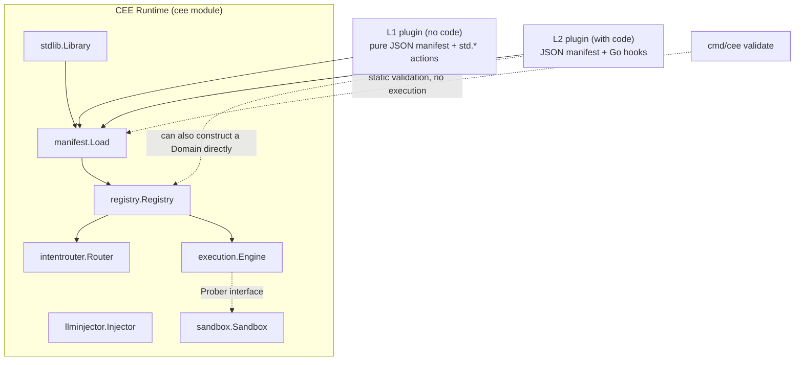
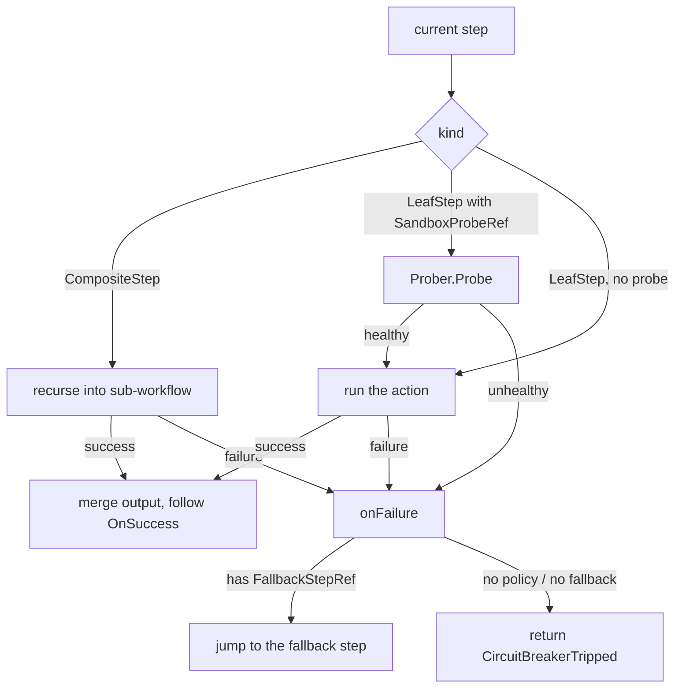

# CEE Technical Specification

Version: corresponds to the current state of the code. This specification describes only what is implemented and
tested; it does not describe roadmap items that have not landed (see section 11).

## 1. Positioning

CEE (Cognitive Execution Engine) is not an application for one industry. It is a **business-agnostic deterministic
execution protocol**. Its core claims:

- Most business processes stuffed into "agents" have a well-defined path and do not need an LLM deciding each step.
  The one place an LLM is genuinely needed is turning unstructured input into structured fields.
- The engine knows *references*, not business content — the four core components exchange only the fixed shapes
  defined in the `entities` package (`IntentNode`, `MatchResult`, `ExtractionRequest/Result`, `ProbeRequest/Result`,
  `WorkflowResult`), never an unagreed map. That is what lets any industry's business logic plug in as a domain plugin
  without changing engine code.

## 2. System architecture



Package responsibilities:

| Package | Responsibility | Key exported types |
|---|---|---|
| `entities` | Defines the fixed data shapes exchanged between components | `IntentNode`, `MatchResult`, `ExtractionRequest/Result`, `ProbeRequest/Result`, `WorkflowResult` |
| `intentrouter` | Intent routing: match natural language to an intent node a domain pre-registered | `Router`, `NewRouter`, `RegisterNode`, `Match` |
| `execution` | The deterministic execution engine (DEE): walk the step DAG, gate on the sandbox, fall back through circuit breakers, suspend/resume around external events | `Engine`, `Step`, `LeafStep`, `CompositeStep`, `Workflow`, `CircuitBreakerPolicy`, `CircuitBreakerTripped`, `Prober`, `Suspended`, `Store`, `MemoryStore`, `State` |
| `llminjector` | Edge LLM injector: text → structured fields only, output clipped to the schema's declared fields | `Injector`, `Schema`, `FieldType`, `Extractor` |
| `llmhttp` | Real LLM backend: hits an OpenAI-compatible endpoint using only `net/http`, produces an `llminjector.Extractor` (zero-dependency) | `Config`, `Extractor`, `Doer` |
| `embedhttp` | Real semantic matching backend: hits an embedding endpoint using only `net/http`, produces an `intentrouter.Vectorizer` (zero-dependency) | `Config`, `New`, `Client`, `Doer` |
| `sandbox` | Pre-execution sandbox: simulate a step with side effects before really running it | `Sandbox`, `Probe` |
| `filestore` | Durable `execution.Store`: suspended processes stored as JSON, surviving restarts | `Store`, `New`, `Pending`, `Orphaned` |
| `registry` | Domain registry: plug a domain plugin's intents/workflows/policies into the shared Router and Engine | `Registry`, `Domain` |
| `replay` | Record and replay the non-deterministic entry points (probes, extraction) to diff a rule change against history | `Recorder`, `Replayer`, `Diff` |
| `draft` | Have a model draft a manifest, behind four validation gates | `Draft`, `Config`, `MaxAttempts` |
| `httpapi` | A mountable `http.Handler` in front of an engine; denies anonymous callers by default | `Config`, `New`, `PendingLister` |
| `scorecard` | Per-request metrics: deterministic steps / LLM calls / sandbox rehearsals / breaker trips / elapsed time, for comparison against a naive-agent baseline | `Scorecard`, `Recorder`, `NewRecorder` |
| `diagnostics` | Cross-run error-side metrics: intent miss rate, probe refusal rate, escalation rate | `Report`, `Recorder`, `NewRecorder` |
| `stdlib` | Standard action library: generic deterministic actions the skeleton ships, referenced and parameterised from pure JSON so plugin authors write no Go | `Library`, `Factory`, `Default` |
| `manifest` | Declarative loader + static validator: bind a JSON DAG to standard actions/named Go functions, and validate reference integrity before running | `Load`, `Validate`, `Report`, `Hooks`, `File`, `StepSpec` |
| `catalog` | Community distribution layer: a git-based plugin directory (index.json + manifest files) supporting listing/validating/installing/benchmarking | `Catalog`, `Entry`, `Load`, `Lint`, `Install`, `ReadBenchmark` |
| `bench` | Benchmark batches: run a set of standard events through a plugin, aggregate Scorecards, rank by determinism ratio | `Suite`, `Event`, `Result`, `Run`, `Leaderboard` |
| `cmd/cee` | CLI: `validate` / `lint` / `list` / `install` / `bench` / `draft` / `serve` | — |

## 3. Core entity model (`entities`)

```go
type IntentNode struct {
    NodeID, DomainID, EntryWorkflowRef string
    Examples []string
    Metadata map[string]any
}

type MatchResult struct {
    Matched bool
    NodeRef, EntryWorkflowRef string
    Confidence float64
}

type ExtractionRequest struct { RawText, SchemaRef, DomainID string }
type ExtractionResult struct {
    Success bool
    StructuredPayload map[string]any
    ValidationErrors []string
}

type ProbeRequest struct {
    ProbeRef, DomainID string
    StepContext map[string]any
}
type ProbeResult struct { Healthy bool; DetectedFailureMode string }

type WorkflowResult struct {
    Output map[string]any
    StatePointer string
    Trace []string
}
```

These seven types are the system's only cross-component contract. Adding a domain plugin, replacing
`intentrouter`'s matching algorithm (with real vector retrieval, say), or swapping `sandbox` for an E2B/Docker
implementation requires no change to them — this is "the engine knows references" expressed at the code level.

## 4. Intent routing (`intentrouter`)

- `Router` stores `IntentNode`s bucketed by `DomainID`. `Match(domainID, rawText)` matches only within the
  corresponding bucket and **never searches across domains** — two domains with highly similar wording cannot
  cross-match (see `TestMatchDoesNotLeakAcrossDomains` in `intentrouter/router_test.go`).
- **The default algorithm is lexical Jaccard similarity** (`tokenize` plus set intersection over union): zero
  dependencies, runs offline. A deliberately lightweight default.
- **Upgrading to semantic matching takes one line**: `router.SetVectorizer(v)` attaches a `Vectorizer`
  (`embedhttp.New(...)` is a real implementation hitting an embedding endpoint), switching matching from lexical
  overlap to **embedding cosine similarity**. So "unusual sign-in from a new device" matches "suspicious login"
  despite sharing no words (see `TestSemanticMatchAcrossVocabulary` in `intentrouter/semantic_test.go`). This bears
  out section 3's promise that replacing the matching algorithm does not touch the contract: the signatures of
  `RegisterNode`/`Match` did not change by a character.
- **Example vectors are computed lazily and cached** (on the first `Match`; afterwards only the query is computed).
  Since `Match` has no error return, a failing embedding endpoint makes `Match` **degrade to lexical matching** rather
  than crash (`TestSemanticFailureDegradesToLexical`) — a flaky embedding service will not take the routing layer down.
- `MatchResult.Matched == false` is an explicit signal, not a guess. The caller should route to `llminjector` for
  extraction rather than have the routing layer force out an answer.

## 5. Deterministic execution engine (`execution`)

### 5.1 The three step shapes

The `Step` interface's method is unexported (`circuitBreakerPolicyRef() string`), meaning **only types defined in
this package can satisfy it** — step shape is closed at the type-system level, and no outside package can add one.
There are currently three:

- `LeafStep`: an atomic action. Its `Run Action` field is a piece of deterministic code
  (`func(ctx map[string]any) (map[string]any, error)`).
- `CompositeStep`: points at a named sub-`Workflow` (`SubWorkflowRef`), letting DAGs nest and reuse rather than
  flattening every process to one grain.
- `ParallelStep`: points at N named sub-`Workflow`s (`Branches`), run concurrently and joined afterwards. See 5.9.

What is closed is the set itself, not its size. Adding a shape means changing the engine and passing its tests; a
plugin cannot slip in a fourth from outside.

### 5.2 The execution loop

`Engine.Run(workflowRef, ctx)` starts at `Workflow.EntryStepID` and proceeds step by step:

1. If the current step is a `CompositeStep`, recurse into `Run(SubWorkflowRef, ctx)`. A sub-workflow failure bubbles up
   as `CircuitBreakerTripped` and is caught by the outer step's own breaker policy (the sole exception being the two
   runaway errors in 5.4, which bypass the breaker and go straight up).
2. If the current step is a `LeafStep` declaring a `SandboxProbeRef`, call `Prober.Probe` first. An unhealthy probe
   takes the breaker path and **the real action is never attempted**.
3. Once the probe passes (or if none was declared), run `Run(ctx)`. The returned map is merged into the current
   context (shallow merge, later keys win) and execution advances to the step named by `OnSuccess`.
4. Any failure (unhealthy probe / action returning an error) enters `onFailure`: look up the policy named by
   `CircuitBreakerPolicyRef`; if it has a `FallbackStepRef`, jump there. Otherwise return a `*CircuitBreakerTripped`
   error, which the caller must handle explicitly. **There are no implicit retries.**
5. A third out-edge: when an action returns `*Suspended` it counts as neither success nor failure. The run is archived
   and a resume pointer returned — see 5.5.



### 5.3 A breaker is a policy reference, not an inline literal

`LeafStep`/`CompositeStep` declare only a `CircuitBreakerPolicyRef string`; the actual `FallbackStepRef` lives in the
global policy table registered via `Engine.RegisterPolicy`. So who references a policy, and how many safety nets exist
in total, can be audited from one place rather than by scanning every step definition.

A fallback step receives two engine-written context fields telling it **which failure it is handling**:

| key | Contents |
|---|---|
| `cee.failure_reason` | Why it failed — the action's error text, or the probe's `DetectedFailureMode` |
| `cee.failed_step` | The ID of the step that failed |

These keys are written only when a breaker actually diverts; a normally completed run's output does not contain them.
The `cee.` prefix exists because this is the one case where the engine puts its own content into a domain's context,
and it must never collide with a domain field.

**Why this is needed**: `reason` used to reach `CircuitBreakerTripped` only when there was *no* fallback, and was
dropped as soon as one existed — exactly backwards. A fallback step exists to handle failure, so it is precisely the
one that needs to know which failure. Writing the sync scenario in `examples/meta_scenarios` exposed this immediately:
the probe's two refusal reasons (the target row was modified by someone / the target row does not exist at all) both
reached the same fallback step, and that step could only report one hard-coded message — making it **confidently wrong
about one of the two cases**. Locked down by `TestTwoProbeVerdictsReachingOneFallbackStayDistinct`.

### 5.4 Runaway ceilings: structural defects should not be absorbed by a breaker

When a DAG's shape is written wrong, two paths in 5.2's loop can run away. Neither is a business failure, so neither
goes through the breaker:

| Defect | Consequence with no ceiling | Ceiling | Error raised |
|---|---|---|---|
| `OnSuccess` forming a cycle | `Run` spins forever, the process hangs | `DefaultMaxSteps = 10000` | `*StepLimitExceeded` |
| `SubWorkflowRef` pointing at itself/mutually | Infinite recursion; the **Go runtime kills the process with `fatal error: stack overflow`, unrecoverable** | `DefaultMaxDepth = 64` | `*DepthLimitExceeded` |

Both ceilings sit far above any legitimate process — a DAG walk normally visits each step at most once. They can be
tuned with `Engine.SetLimits(maxSteps, maxDepth)` but **cannot be switched off**: a non-positive value just keeps the
default. The reason is that a runaway is a process-level hazard, not one workflow's business, and no single plugin
should be able to remove the whole runtime's guardrail.

`*StepLimitExceeded` carries the tail of the trace (the last 10 steps), which is where the cycle is.

A deliberate trade-off: **these two errors bypass the breaker and bubble straight up.** When a sub-workflow runs away,
`CircuitBreakerPolicyRef` is not consulted and no fallback is taken. A breaker's semantics are "a business action
failed, take the alternate path," whereas a DAG cycle is a **structural defect** — letting a fallback swallow it hides
the bug, and the outer loop might re-enter the same broken sub-workflow repeatedly. Locked down by
`TestRunawayIsNotSwallowedByACircuitBreaker`.

The ceilings are the runtime's last line of defence; **normally both defects should be caught at `cee validate` time**
(see 8.4) and never reach runtime at all.

### 5.4.1 Compensation: the half a probe cannot reach

A sandbox probe handles **don't take the action that would cause trouble**. But it has nothing to say about this:

> The process failed at step 4, and steps 1, 2, and 3 already transferred money, reserved a seat, and shipped goods.

Whether the breaker jumps to a fallback or trips, **the first three steps' side effects remain in the world**. This is
the missing half of the promise to "execute irreversible operations safely."

So a `LeafStep` may declare `CompensateStepRef` (`compensate_with` in a manifest), naming a step in the same workflow
that undoes it. When a run is **abandoned**, the engine unwinds the completed steps that declared a compensation, in
**reverse order**:

```
charge → reserve → issue(fails)
                   ↓
         release → refund        reverse: release the seat first, then refund
```

Reverse order is not ceremony — later steps are usually built on earlier ones, and undoing the earlier ones first
leaves the later compensation facing an incoherent world.

Three deliberate boundaries:

- **It unwinds only on abandonment, not on every failure.** A step declaring a fallback is saying "I have a plan B,"
  and entering plan B is the expected handling; tearing down the work behind it would be wrong. Locked down by
  `TestAFallbackDoesNotTriggerAnUnwind`.
- **A failed compensation is never retried and never swallowed.** It is collected into
  `CircuitBreakerTripped.CompensationFailures` and appears in the error text as `COULD NOT UNDO` — **the action
  happened, undoing it also failed, and the world is in a state nobody chose. That is the worst outcome the engine can
  report**, and only a person can resolve it.
- **Structural errors do not trigger compensation.** A DAG cycle or a misconfigured suspension means **the shape of
  the process itself is wrong**, and executing undo actions from an untrustworthy description is more dangerous than
  not undoing at all.

A step that declared no compensation is honestly reported as "cannot be undone" rather than silently skipped — an
email that was sent cannot be recalled, and pretending it can is worse than admitting it cannot.

`cee validate` statically rejects dangling `compensate_with` references and self-references: **a dangling compensation
is worse than none**, because the process believes it is rollback-safe right up until the moment it is abandoned.

### 5.5 Suspend and resume: waiting for a person is not failure

When a process reaches "wait for something outside" (human approval, a callback, a time window), neither out-edge in
5.2 fits: it has not succeeded, but it has **not failed** either. Absorbing it with a breaker treats "waiting" as "an
error," and the waiting is silently dropped.

Hence a third out-edge: the action returns `*Suspended`.

```go
// in Go:
return execution.Suspend("awaiting human approval")
```
```json
// in a no-code manifest:
{"step_id": "hold_for_human", "type": "leaf", "action_ref": "std.suspend",
 "with": {"reason": "awaiting manager decision"}, "on_success": "apply_decision"}
```

Using an error as a control signal follows the standard library's precedent with `fs.SkipDir`: it is recognised by
type, and is not a fault. On seeing it the engine **does not consult the breaker, take a fallback, or retry**.
Instead it:

1. Saves the current `ctx`, `trace`, and the suspension point's `StepID` and `Reason` into the `Store`;
2. Generates an unguessable `crypto/rand` pointer and fills in `WorkflowResult.StatePointer`. **A completed run leaves
   this field empty**, so `StatePointer != ""` is exactly the test for "did this run park?" and means nothing else.
   (It used to be filled with `workflowRef` on normal completion, from before suspension existed. Two meanings crammed
   into one field made the most natural test silently wrong for every normal completion.)
3. Returns normally (`err == nil`) — parking is not an error.

`Engine.Resume(pointer, resolution)` merges the external decision into the saved context and **continues from the
suspended step's `OnSuccess`** (the wait is over, so the suspension point itself does not re-run).

Several deliberate constraints:

- **The pointer is single-use**: `Resume` removes it from the store before executing. The same approval cannot be
  replayed.
- **No `Store` configured is an error**: without `SetStore`, suspension returns `*NoSuspensionSupport` rather than
  degrading into an ordinary failure a breaker would swallow.
- **`Store` is an interface** with two implementations: `execution.MemoryStore` (in-process, concurrency-safe, lost on
  restart — fine for development and tests) and `filestore.Store` (durable, survives restarts). `State` is a pure value
  type containing no engine pointers, so it serialises directly. Swapping implementations does not touch the engine,
  exactly as with `Prober`. See 5.6.
- **No new primitive is needed to branch after resuming**: `resolution` is an ordinary context field, so the next step
  can compare `approved` with `std.require`, failing through the breaker to a "rejected" branch — reusing the
  mechanism from 8.3.

A complete runnable example: `examples/human_approval` (a pure L1 plugin with zero Go hooks). Its trace remains one
continuous line across the suspension:

```
[check_threshold hold_for_human apply_decision record_approved]
```

### 5.5.1 Who may resume: turning off the bearer token

The resume pointer is `crypto/rand`-generated and unguessable, which blocks "someone found it." It does not block
**someone legitimately obtaining it**: a forwarded email, a link pasted into a group chat, a line in a log. Possession
was approval, and the engine could neither question it nor record who approved.

So a suspension may declare an **audience** — a domain-defined opaque name for "who is entitled to answer":

```go
return execution.SuspendFor("amount over limit, needs manager approval", "finance-manager")
```
```json
{"action_ref": "std.suspend",
 "with": {"reason": "amount over limit", "audience": "finance-manager"}}
```

The engine **never interprets** the audience. It hands it, along with the identity the caller claims, to the
`Authorizer` the domain provides — the same arrangement as handing probe requests to a `Prober`. Resuming uses
`ResumeAs(pointer, identity, resolution)`.

Three rules make this meaningful rather than decorative:

- **Deny by default.** A suspension declaring an audience is **always refused** on an engine with no `Authorizer`
  configured. Silently allowing it would reduce the declaration to a comment. Locked down by
  `TestAnAudiencedSuspensionFailsClosedWithNoAuthorizer`.
- **A refusal does not consume the pointer.** Otherwise anyone holding the link could destroy a pending approval
  simply by lacking permission — **access control would become denial of service.** The authorisation check therefore
  runs before `Consume`. Locked down by `TestARefusalDoesNotConsumeThePointer`.
- **An authorizer error is a refusal.** An authorizer that cannot reach the directory service **has not said yes**, and
  the pending approval must be preserved.

The approver's identity is written into the resumed context (`cee.resumed_by`) — **a decision needs an author, not
just an outcome.**

The engine **does not authenticate** that identity: proving who you are belongs to the service in front of the engine,
and treating an unverified string as proof here would be worse than not asking. What the engine guarantees is that a
suspension declaring an audience is not resumed without the domain authorizer agreeing, and that whoever answered is
on the record.

Workflows that declare no audience behave exactly as before.

### 5.6 The durable store (`filestore`)

`MemoryStore` is lost on restart, and "wait for human approval" naturally spans hours or days — an approval flow that
loses its whole pending queue on one restart is unusable in practice. `filestore.Store` writes each suspended process
to a JSON file named by its resume pointer:

```go
store, err := filestore.New("./state")   // directory 0700, files 0600
engine.SetStore(store)
```

It lives in its own package rather than in `execution` for the same reason as `sandbox`: the engine depends only on
the `Store` interface, and file I/O does not belong in the engine kernel.

Several implementation decisions:

- **Atomic writes**: write a temp file, `Sync` it to disk, then `rename`. `rename` is atomic on POSIX, so a reader sees
  either the old file or the new one and never a half-written state; a crash mid-write leaves only a temp file, with
  the original state intact. `Sync` before `rename` is necessary — this store exists to survive crashes, and
  "rename lands before contents" does not.
- **The pointer is the filename, so the pointer must be validated.** The pointer passed to `Load`/`Delete` comes from
  outside (a CLI argument, an HTTP parameter), and using it directly as a filename is building a path from untrusted
  input. `checkPointer` restricts it to `[A-Za-z0-9_-]`, so separators, `..`, NUL, and absolute paths cannot get
  through. It validates the character set rather than "must be 32 hex digits," so a future change to the pointer format
  does not break it.
- **`Delete` on a pointer that no longer exists must error**, never silently succeed — the engine relies on `Delete` to
  guarantee approvals cannot be replayed, and swallowing the error here hides a duplicate resume.
- **`Pending()` skips corrupt files rather than failing wholesale**: one damaged file should not blind an operator to
  every other pending item.
- **Permissions**: directory `0700`, files `0600`. Suspended state carries business context (amounts, names,
  hostnames) and should not be world-readable.

**One trade-off you must know about**: `State.Ctx` is a `map[string]any`, and after a JSON round trip **every number
becomes a `float64`**. Standard actions are unaffected (`stdlib` comparisons all go through `toFloat`), but a Go hook
writing `ctx["n"].(int)` after a resume will panic. Either assert `float64`, or keep non-JSON-native types out of the
context of a process that can suspend. This behaviour is pinned by `TestNumbersComeBackAsFloat64` and will not change
quietly.

### 5.7 `Consume`: making "taking" one indivisible action

The `Store` interface has **no `Delete`**. There is exactly one way to take a pointer: `Consume(pointer) (State,
error)`, which atomically reads and removes.

This is not because the original `Load` + `Delete` had a race — it was actually safe, since `unlink`/`os.Remove` is
itself atomic, and when two processes delete the same file only one succeeds while the other gets `ENOENT` and stops.
**The real risk is that this correctness came from an implementation detail rather than the interface contract**:
someone later writing a Redis or SQL backend could easily implement `Delete` as "just delete it, don't report whether
anything was there," and at that moment "approvals cannot be replayed" silently stops holding, with nothing raising an
error. `MemoryStore` was originally written exactly that way.

So the interface exposes only the atomic operation: an implementer has no opportunity to split it into a pair of calls
that look fine. A side benefit is one fewer round trip for network backends.

`filestore` implements it as a `rename` claim: rename `<pointer>` to `<pointer>.<random>.claimed`. POSIX guarantees
only one concurrent `rename` succeeds; the rest get `ENOENT`. It is deleted after reading.

`Engine.Resume`'s order is **`Load` (non-claiming validation) → `Consume` (atomic claim) → execute**. Validating with
a non-claiming `Load` first lets cases like "that workflow is no longer registered" be reported **without destroying**
the archive — otherwise one deployment change would eat the pending approval queue.

### 5.8 Two-phase claiming: a crash should not make an approval vanish

`Consume` in 5.7 guarantees a pointer can only be taken once. But it originally deleted the state immediately after
taking it, leaving a subtler hole: a process claims successfully, then crashes halfway through the run — and that
pending approval is neither finished nor in the archive. **No trace of it at all.**

So claiming became two-phase:

| Phase | What it does |
|---|---|
| `Consume` | Atomically claim, renaming `<pointer>` to `<pointer>.<random>.claimed`, **keeping it** |
| `Release` | Actually delete the claim, only after the resumed run finishes |

`Engine.Resume` calls `Release` **on every path out of `runFrom`, success or failure alike** — either way the decision
has been acted on and must not be acted on twice. The only path that skips `Release` is the process dying inside
`runFrom`, which is exactly the case this mechanism exists to record.

So "a claim still sitting there" becomes a precise signal: **some process took this work and did not finish it.**
`filestore.Orphaned(minAge)` surfaces these, with the pointer, the suspension reason, and when it was claimed.

**Key design decision: `Orphaned` only reports; it does not re-queue automatically.**

Automatically putting orphans back on the queue is the natural idea, and it is wrong: the engine **has no idempotency
mechanism whatsoever.** A crashed run may already have moved money or isolated a host and simply not finished the
remaining steps. Re-running it as though it never happened is worse than leaving it stopped. So the facts go to the
operator — which one, waiting on what, claimed when — and a person decides whether to complete it or void it.

`MemoryStore.Release` is a no-op, which is also honest: it disappears with the process, so "a claim outliving the
process" cannot happen, and pretending otherwise would promise durability an in-memory map cannot deliver.

### 5.9 Parallelism and joins (`ParallelStep`)

A step used to have exactly one `on_success` out-edge, so "run three independent checks at once and decide when they
are all back" had to be flattened into a sequence, or written by hand in an L2 Go hook with its own goroutines. The
latter is the worse outcome: **dropping to Go in order to express a shape bypasses the no-code contribution tier**,
which is the precondition for a plugin ecosystem.

A `ParallelStep` names a set of sub-workflows as branches:

```json
{"step_id": "run_checks", "type": "parallel",
 "branches": ["onboarding.credit_check", "onboarding.sanctions_check", "onboarding.address_check"],
 "circuit_breaker_policy_ref": "route_to_manual_review", "on_success": "require_all_clear"}
```

Each branch receives **its own copy of the incoming context**, runs on its own goroutine, and the results join
afterwards.

#### 5.9.1 Genuinely concurrent, yet independent of scheduling

This is the only genuinely hard part of the section: determinism is the entire thesis, and real concurrency is the
most natural way to lose it.

So scheduling decides only **when** work happens, never **what the answer is**:

- **Branches join in declaration order**, not completion order.
- **Traces concatenate in declaration order**, not completion order.

A slow branch and a fast one therefore produce byte-identical traces and outputs on every run. Locked down by
`TestParallelJoinIsDeterministicWhateverTheSchedulingOrder`, which runs one workflow twenty times with a deliberate
delay in one branch and requires the traces to match exactly.

Branches **cannot see each other's writes** (each starts from a copy of the incoming context). This is not isolation
for its own sake: it is the precondition that makes the order-independence above true rather than usually true. If
branches could observe each other, the result would depend on which ran first.

#### 5.9.2 Two branches writing one field: refused, not arbitrated

Picking a winner by declaration order would be deterministic and **still wrong** — nothing in the workflow says which
should win. So the engine reports `*ConflictingBranchWrites` and refuses to join.

The check is based on **each branch's delta against the incoming context**, not a direct comparison of branch outputs.
That distinction is necessary: a sub-workflow's `Output` contains all the context it inherited, so "A changed `status`
and B never touched it" would be misread as a conflict if outputs were compared directly.

- Same field, same value: not a conflict.
- One branch changed it, another left it alone: not a conflict.
- Same field, different values: refused.

Conflicts, like `*NoBranches` and a runaway branch, **bypass the circuit breaker**, for the reason given in 5.4: a
breaker absorbs business failures, and letting a fallback swallow a structural defect hides the bug. Locked down by
`TestAConflictIsNotSwallowedByACircuitBreaker`.

#### 5.9.3 Failure, panics and suspension

- **Every branch is awaited before anything is reported.** Returning early would leave goroutines still running.
- **Every failed branch is reported**, not just the first, in declaration order (`*BranchesFailed`). An operator needs
  to know which two of three checks broke.
- Ordinary business failures **do reach the breaker**, and `cee.failure_reason` carries every branch's reason.
- **A panicking branch becomes `*BranchPanicked`.** A panic inside a goroutine cannot be recovered by the caller and
  would take the process down — a regression against today's behaviour, where a panicking action unwinds to whoever
  called `Run`. Converting it preserves the existing blast radius and names the branch responsible.
- **Suspending inside a branch is refused.** Branches run at `depth+1`, so the existing nested-suspension rule from
  5.5 applies and returns `*NestedSuspensionUnsupported`. Resuming would require reconstructing the whole fan-out call
  stack, which `State` does not record.

#### 5.9.4 Static validation

`cee validate` catches an empty branch list, a branch naming no `workflow_id`, and the same branch listed twice (which
would join a workflow against itself). A single branch is a warning rather than an error — legal, just a composite
step spelled the long way.

**Cycle detection follows branch edges**: a branch pointing back at its own parent is a cross-workflow cycle that
overflows the stack at runtime, so it has to be caught during validation. Locked down by
`TestValidateCatchesACycleThroughABranch`.

A complete no-code example is `examples/manifests/onboarding-checks.json`: three independent screening checks fanned
out and joined, then two thresholds, with no Go at all.

## 6. Edge LLM injector (`llminjector`)

The core behaviour of `Injector.Extract` is not "call an LLM" but **filter the LLM's output**:

```go
clean := make(map[string]any, len(reg.schema))
for field, wantType := range reg.schema {
    value, present := payload[field]
    ...
    clean[field] = value   // only copy fields the schema declared
}
```

Even if the registered `Extractor` smuggles fields outside the schema into its return value (a decision field like
`is_fraud`, say), `clean` will not contain it — this red line is guaranteed by the interface's behaviour and does not
depend on manually reviewing extractor implementations (see `TestExtractionStripsUnschemaFields`). `FieldType`
currently supports the three minimal usable types `FieldString`/`FieldFloat64`/`FieldBool`.

## 7. Pre-execution sandbox (`sandbox`)

`Sandbox.Probe` satisfies `execution.Prober`. Internally it just forwards `ProbeRequest.StepContext` to the registered
`Probe` function (`func(map[string]any) (healthy bool, failureMode string, err error)`) and folds the outcome into a
single `ProbeResult` — a probe returning a Go error and a probe returning `healthy=false` are treated identically by
the engine, so the caller handles one failure path. The current implementation is a direct in-process call and is not
yet wired to a genuinely isolated environment in the core; the `Prober` interface guarantees that swapping the
implementation (for `satellites/dockersandbox` or `satellites/httpsandbox`) does not affect `execution.Engine`.

## 8. Standard action library and the no-code tier (`stdlib` + `cmd/cee`)

Sections 1–7 describe how the engine runs. This section describes how other people plug in — the two are orthogonal: a
plugin author can publish a working domain plugin without ever understanding the execution loop in 5.2.

### 8.1 Two contribution tiers

| Tier | What the author must know | Deliverable |
|---|---|---|
| L1 (no code) | JSON only | One manifest, with every `action_ref` pointing at a `std.*` standard action |
| L2 (with code) | Go | A manifest plus a `Hooks` map, with logic the standard library cannot express written as named Go functions |

`manifest.Load(data, hooks, std)` binds **standard library first, hooks second** (see `resolveAction`): an
`action_ref` is looked up in `std` first, then in `hooks`, and only errors if neither has it. So L1 and L2 can be mixed
in the same manifest.

### 8.2 The shape of a standard action: a Factory, not an Action

What gets registered into a `Library` is not an `execution.Action` but a `Factory`:

```go
type Factory func(params map[string]any) (execution.Action, error)
```

A `Factory` receives that step's `"with"` parameter block, **validates and binds once at load time**, and returns an
`Action` with the parameters already closed over. This gives an important property: **a mis-written parameter fails at
`Load`, not halfway through a run** — the same principle as section 3 of the normative handbook ("a mis-written
manifest should fail at load time").

The current built-in actions:

| Action | What it does | Affects control flow? |
|---|---|---|
| `std.set` | Write a fixed set of fields into the output; used for terminal/marker steps | No |
| `std.require` | Assert `field op value`; **the step fails if unsatisfied** | Yes — failure goes to the breaker |
| `std.rule_check` | Compute the boolean result of `field op value` into `result_field` | No — it annotates without branching |
| `std.suspend` | Suspend the process to wait for an external event (see 5.5); needs `reason` | Yes — but neither succeeds nor fails; returns a resume pointer |
| `std.require_verified` | Assert that the named fields are not model-derived guesses (see handbook 1.1.2) | Yes — failure goes to the breaker |

Supported `op` values: `eq` / `neq` / `gt` / `gte` / `lt` / `lte` / `in`. Numeric comparisons all go through
`toFloat`, so JSON's `10000` (a `float64`) compares correctly against Go's `int`.

### 8.3 Expressing if/else without code: borrowing the breaker

The engine itself has **no if/else primitive**. A step has two out-edges: "succeed and follow `OnSuccess`" or "fail and
take the breaker." `std.require` uses exactly this to express branching:

```json
{"step_id": "check_threshold", "type": "leaf", "action_ref": "std.require",
 "with": {"field": "amount", "op": "lte", "value": 10000},
 "circuit_breaker_policy_ref": "route_to_flag", "on_success": "approve"}
```

Read as: "require amount ≤ 10000; if satisfied go to `approve`, otherwise let the `route_to_flag` policy send me to
`flag`."

This is not abusing the breaker as a branch statement — it is a deliberate trade-off: **branching and exception
handling already share the same "deviate from the main path" out-edge**, and merging them into one mechanism means a
governance owner auditing "what non-main-path exits does this process have" only has to look at the policy table
(per 5.3). The cost is slightly indirect readability, which `PolicyID` naming (`route_to_flag`) has to carry.

A complete runnable example: `examples/manifests/expense-guard.json`.

### 8.4 Static validation (`manifest.Validate` + `cee validate`)

`Validate(data, std)` executes nothing; it checks structural and reference integrity, producing a `Report` (an `Error`
makes `Report.OK()` false; a `Warning` does not). Current coverage:

- Whether the steps named by `entry_step_id` / `on_success` actually exist in this workflow
- Whether `circuit_breaker_policy_ref` names a declared policy, and whether its `fallback_step_ref` exists in this
  workflow
- Whether `sub_workflow_ref` / `intent.entry_workflow_ref` resolve to some `workflow_id` (the old name
  `entry_step_ref` is still accepted, with a deprecation warning)
- Duplicate `step_id`, missing `action_ref`, unknown `type`
- Whether a standard action's `with` parameters are valid (by calling the `Factory` to attempt binding)
- **`on_success` cycles** (error) — this path will certainly spin `Run` until it hits the ceiling; the report prints
  the cycle path, in the form `a -> b -> a`
- **`sub_workflow_ref` cycles** (error) — worse than the previous one, since at runtime it overflows the stack and
  kills the process, so it must be caught
- Four warning-only categories: a `node_id` missing its domain prefix; an `action_ref` that is not a standard action
  (whether it exists can only be checked against hooks at `Load` time); **orphan steps unreachable from
  `entry_step_id`**; and **cycles that close only through a breaker fallback**

The severity split on the last one is worth explaining: `on_success` is the edge taken on success, so a cycle there
**necessarily** spins — hence an error. A fallback edge is taken only on failure, so a cycle there means "it only spins
if it keeps failing." It could indeed fail to terminate, but requires a triggering condition, and calling it an error
would flag legitimate designs. Hence a warning. This split is locked down by
`TestValidateWarnsButDoesNotFailOnFallbackLoop`.

Command line:

```bash
go run ./cmd/cee validate examples/manifests/expense-guard.json
```

Exit code `0` = no errors, `1` = errors, `2` = usage/file-read problem — usable directly as a CI gate. This is the
first step in turning some of the normative handbook's red lines from manual code review into automated checks.

## 9. Metrics and benchmarking (`scorecard`)

The community needs **provable numbers** for "more efficient than an agent," not slogans. `scorecard` is where those
numbers come from.

### 9.1 Instrumentation: an optional Observer, zero intrusion

`execution.Engine` and `llminjector.Injector` each expose a `SetObserver(...)`, defaulting to `nil` with zero
overhead. The engine calls back on each step execution / sandbox rehearsal / breaker diversion; the injector calls back
each time it really invokes an extractor. `scorecard.Recorder` satisfies both Observer interfaces **structurally, at
the method-set level** — so the `scorecard` package **does not import** `execution` or `llminjector`, keeping its leaf
position and creating no reverse dependency.

### 9.2 The baseline model: honest, no token estimation

The comparison model is chosen deliberately: **a naive agent = one LLM call per step.** Under that model, every
deterministic step the engine runs is exactly **one LLM call CEE eliminated** relative to an agent. So the headline
metric `DeterminismRatio = deterministic steps / (deterministic steps + LLM extractions)` is not an estimate but "the
share of LLM calls that should have happened and did not" — it holds without guessing token counts, and only becomes
more precise once a real LLM is wired in.

What is counted is **actual execution**, not path visits: a step blocked by the sandbox whose action never ran does not
count as a deterministic step (it counts as a sandbox rehearsal plus a breaker trip). Scenario 2 in
`examples/security_monitoring` therefore shows "2 deterministic steps + 1 rehearsal + 1 breaker" rather than 3 steps by
trace length — run `go run ./examples/security_monitoring` to see both scenarios' live Scorecards.

### 9.3 The error side: diagnostics (`diagnostics`)

The scorecard measures output — steps run, calls eliminated — which are the flattering numbers. Measuring only those is
a bias, and it leaves three questions the scorecard structurally cannot answer:

- **intent miss rate** — routing attempts that matched no intent
- **probe refusal rate** — probes that refused their step
- **escalation rate** — suspensions per run

`diagnostics.Recorder` aggregates these across many runs, rather than scoring one. Each needed a signal that did not
exist before: `intentrouter.Observer` (attached with `router.SetObserver`) reports every match outcome — this is the
mechanism §5.2's routing layer previously lacked; `execution.ProbeOutcomeObserver` (an optional extension of
`Observer`) reports whether each probe passed or refused, which a bare breaker count cannot separate from a failed
action or sub-workflow; and escalation reuses the existing suspension signal over a run count the caller supplies with
`ObserveRun`, because the engine does not decide what a caller counts as one request.

Rates are zero over no data rather than a division by zero — a rate with no denominator is missing data, not a good
score. Like `scorecard`, the package is a leaf: it satisfies the router and engine observer interfaces structurally and
imports neither. `examples/security_monitoring` prints an aggregate report alongside its per-event scorecards.

## 10. Community distribution (`catalog` + `cee list/lint/install`)

`catalog` is the simplest possible starting point for a plugin ecosystem: **no service, no database — a catalog is an
`index.json` plus the manifest files it points at.** Contributing a plugin is one PR, nothing more. A hosted registry
can be added later behind the same `Entry` shape; it is not being built now.

### 10.1 Directory shape

```
catalog/
  index.json                         lists each plugin: name/description/version/tier/domain/manifest path/tags
  plugins/<name>/manifest.json       the actual plugin manifest (pure declarative L1 can be distributed whole)
```

The repo ships two cross-domain L1 samples: `sla-guard` (support/ops domain) and `access-review` (security/compliance
domain), both with zero Go code, proving multiple plugins across multiple domains coexist in one catalog.

### 10.2 Two gates in the distribution layer

- **`Catalog.Lint`** (`cee lint`): validates the whole catalog — names unique, tiers legal, manifests present with
  their declared name matching the entry, and every manifest passing `manifest.Validate`. It reuses `manifest.Report`,
  so `cee lint` and `cee validate` speak the same language and both work as CI gates. `TestRepoCatalogLintsClean` in
  `catalog/catalog_test.go` uses `Load(".")` to ensure the repo's own catalog always lints clean.
- **`Catalog.Install`** (`cee install`): **validate before writing to disk** — a plugin that fails
  `manifest.Validate` is never written into the local `plugins/`. This is the install-time quality gate, locked down
  by `TestInstallRefusesInvalidManifest`.

### 10.3 L1 can be distributed as data; L2 cannot

A catalog carries L1 (pure manifest) plugins, which `install` can pull down and `manifest.Load` can run directly
(`TestInstallAndRunFromRepoCatalog` proves the "catalog to live engine" path). L2 plugins needing a Go hook still go
through Go module distribution; an `Entry` can describe one with `tier: "L2"` so it is discoverable, but `Install`
only handles manifests it can validate completely.

### 10.4 Benchmark batches and the leaderboard (`bench` + `cee bench`)

For "more efficient than an agent" to become community momentum, it has to be **a leaderboard people can compete on**,
not an assertion. A plugin can declare a `benchmark` field in its entry, pointing at a standard event set
(`plugins/<name>/benchmark.json`: a set of `{workflow_ref, context}`). `cee bench` runs each plugin's events through an
engine with a `scorecard.Recorder` attached, aggregates them into a `bench.Result`, and ranks by determinism ratio:

```
rank plugin           determinism  events   errors   LLM calls eliminated vs agent
1    access-review    100%         4        0        8 of 8
2    sla-guard        100%         4        0        8 of 8
```

The ranking reuses the honest baseline from 9.2: the aggregate determinism ratio is the share of calls eliminated
versus an agent making one LLM call per step. A single failing event (a breaker with no fallback, say) counts into
`Errors` and execution continues, so one bad event cannot obscure the batch (guaranteed by `bench.Run`). This is the
first step in turning the Scorecard from a single measurement into a cross-plugin, sortable, brag-worthy social
mechanism — a hosted leaderboard, real token dimensions, and a live agent control group are all still on the roadmap.

## 11. Current scope and known limitations

The following are **not implemented** — roadmap items, not present in the code — stated to avoid confusion with the
actual state:

- **Agent fallback tier**: a two-stage escalation ("after repeated extraction failures, fall back to a constrained
  agent") was discussed and explicitly decided against. Extraction failure currently leaves the next move to the
  caller (usually escalation to a human); the engine does not build this in.
- **Real backends**: **mostly delivered; only the built-in sandbox is still an in-process simulation.**
  `llminjector` can attach `llmhttp` (a real OpenAI-compatible endpoint); `intentrouter` can attach `embedhttp` (real
  embedding semantic matching); `execution.Store` can attach `filestore` (durable, survives restarts);
  `execution.Prober` can attach `satellites/dockersandbox` (local container) or `satellites/httpsandbox` (remote/cloud
  sandbox). The core's built-in `sandbox.Sandbox` remains a direct in-process call for development and testing.
  Distributed orchestration (Temporal-style semantics) is **explicitly out of scope**.
- **Scenario template library**: all six meta-scenarios (anomaly detection, approval flows, data sync, ticket routing,
  scheduling, security monitoring) **have landed as runnable examples** (see `examples/`), plus two real cases
  (network intrusion detection, market surveillance). **What has not been done is abstracting them into reusable
  template packages** — each is currently a standalone example that a new adopter modifies by hand, rather than
  parameterises.
- **No suspension TTL or timeout escalation**: waiting has no end — see the `filestore` note below.
- **Hot-loading is still not provided**: the engine's registration path is now guarded by an `RWMutex`, so registering
  while running is no longer a data race. But nothing in the repo watches a directory, discovers new manifests and
  re-registers them. The lock was the precondition, not the feature.
- **Observers must now be concurrency-safe**: branches run concurrently, so an `Observer` is called from several
  goroutines at once. Both implementations in this repo, `scorecard.Recorder` and `replay.Recorder`, hold mutexes; a
  third-party implementation has to provide its own safety.
- **Nested suspension**: suspension (see 5.5) currently supports only top-level workflows. A step suspending inside a
  sub-workflow returns `*NestedSuspensionUnsupported` — resuming it would require reconstructing the whole composite
  call stack, and `State` does not record stack frames. This is a deliberate refusal rather than a best-effort
  recovery: resuming into an intermediate state nobody can describe is worse than erroring out.
- **`filestore` has no expiry/reclamation**: suspended processes sit in the directory indefinitely. A process that
  never gets its approval does not disappear on its own, and there is no TTL or archival mechanism — operators must
  clean up using `Pending()`.
- **`filestore` does not lock across processes**, but **the single-use guarantee itself does hold across processes** —
  see 5.7; it relies on the atomicity of `rename`/`unlink` and needs no lock. What is missing is fairness (first come,
  first served) and the fact that orphans require human judgement (see 5.8 — deliberate, not an oversight).
- **Cross-manifest cycles**: cycle detection runs **within a single manifest only** (see 5.4). If domain A's composite
  step points at domain B's workflow and B points back at A, `Validate` cannot see it — it reads one file at a time.
  Such cross-domain cycles are ultimately caught by the engine's depth ceiling, but are not found early at validation
  time.
- **Standard action library coverage**: `stdlib` currently has five actions
  (`set`/`require`/`rule_check`/`suspend`/`require_verified`), enough to express "threshold check + tagging + wait for
  a person + reject guessed values," but **no I/O actions at all** (HTTP calls, database reads). The L1 no-code tier
  can therefore only build pure-computation processes; genuinely touching an external system still requires dropping to
  L2 and writing a Go hook.
- **Scorecard's token dimension**: `scorecard` measures operation counts (deterministic steps / LLM calls) and elapsed
  time. `DeterminismRatio` holds and is genuine under the "one LLM call per step" baseline. The leaderboard and
  benchmark suite **have landed** (the `bench` package + `cee bench`), but two things still do not exist: **real token
  consumption figures**, and **a live agent control group**. So "how much money did it save" can currently only be
  answered in call counts, not currency.
- **Diagnostic metrics land, aggregation does not persist**: the `diagnostics` package (§9.3) now measures the error
  side — intent miss rate, probe refusal rate, escalation rate. What it does not yet do is persist or export those
  counters; a `Recorder` lives in memory for the life of the process, so a long-running deployment needs to scrape or
  snapshot it itself. There is no metrics endpoint and no time-series output.
- **Ecosystem**: the `catalog` currently holds 2 plugins, both samples shipped with the repo, and the `cee bench`
  leaderboard has no third-party entries. The no-code contribution tier, distribution catalog, and determinism
  leaderboard are **architecturally ready with zero fuel.**
